# Hermes OS — Architecture Reference

> **Document de référence** pour l'architecture globale d'Hermes OS.
> Couvre HOS-000 à HOS-028.

---

## 1. Architecture Globale

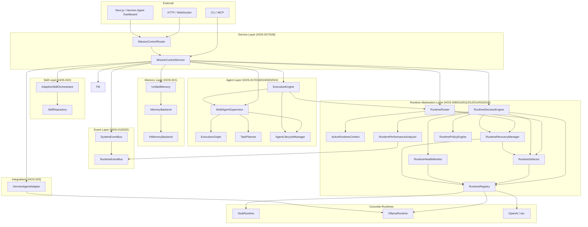

---

## 2. Kernel Hermes OS

### 2.1 HOS-000 — Foundation (SDS)

Le noyau historique SDS (Software Defined Services) comprend :

- **EventBusImpl** — bus d'événements SQLite
- **RuntimeHolder** — singleton runtime legacy
- **SDS Router** — routes FastAPI `/api/hermes-os/*`
- **Forward EventBusImpl → EventHub** — pont vers le legacy

### 2.2 HOS-001 — RAL Interfaces

Le Runtime Abstraction Layer (RAL) commence avec les contrats fondamentaux :

```python
class RuntimeInterface(Protocol):
    name: str
    version: str
    status: RuntimeStatus
    capabilities: CapabilitySet | None

    async def start(self) -> None: ...
    async def stop(self) -> None: ...
    def get(self, name: str) -> Any | None: ...

class ChatCapability(Protocol):
    async def chat(self, messages, *, runtime_ctx=None) -> ChatResponse: ...
```

### 2.3 HOS-002 — EventBusImpl

Implémentation concrète du bus d'événements :

- Stockage SQLite
- Publication/abonnement par topic
- `TopicPattern("*")` pour le forwarding wildcard

### 2.4 HOS-003 — SDS Wiring

Câblage FastAPI :

- `lifespan` initialise EventBusImpl → RuntimeHolder
- `SDS_ROUTER` expose les endpoints SDS
- Tests d'intégration SDS

---

## 3. Runtime Abstraction Layer (HOS-004 → HOS-016)

### 3.1 StubRuntime (HOS-004)

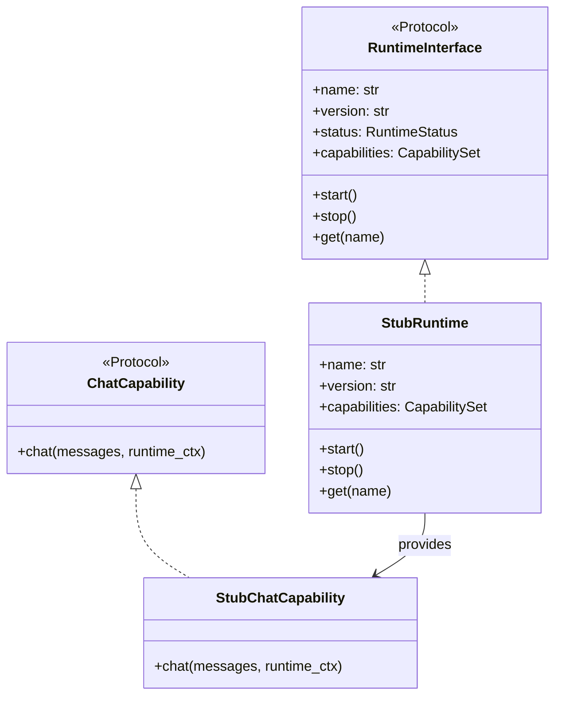

Premier runtime concret. Publie `RUNTIME_STARTED` / `RUNTIME_STOPPED`.

### 3.2 HermesOllamaRuntime (HOS-005)

Runtime agentique réel basé sur Ollama :

- Implémente `RuntimeInterface`
- Capacité `Chat` complète
- Configuration via `RuntimeConfig`

### 3.3 OllamaClient (HOS-006)

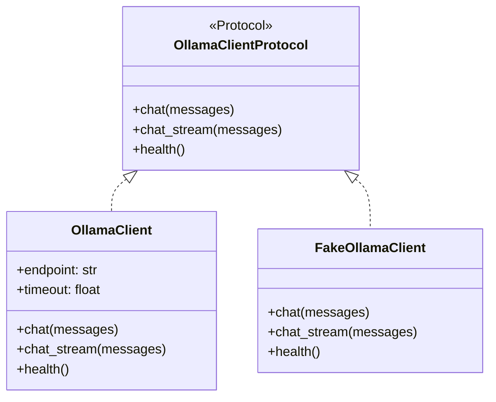

Client HTTP configurable, mocké en tests.

### 3.4 RuntimeRegistry & RuntimeFactory (HOS-007/008)

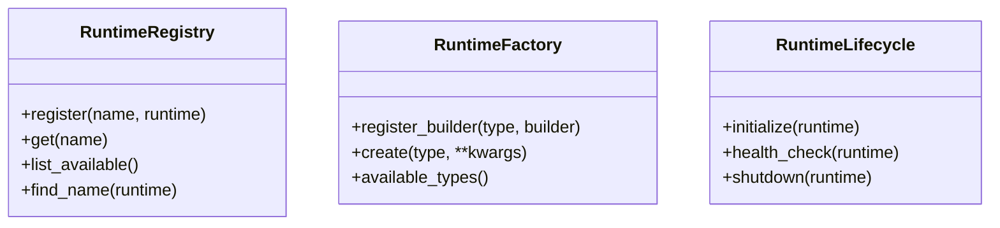

### 3.5 ActiveRuntimeContext & RuntimeSelector (HOS-009)

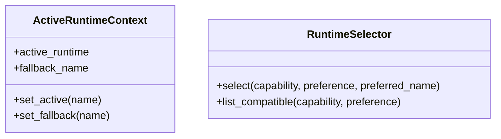

### 3.6 RuntimeRouter (HOS-010)

Point d'exécution central :

1. Tente le runtime actif
2. Fallback configuré
3. Préférence explicite
4. Sélecteur automatique

### 3.7 RuntimeHealthMonitor (HOS-011)

```python
class RuntimeHealthMonitor:
    def check_runtime(self, name) -> RuntimeHealthStatus: ...
    def is_available(self, name) -> bool: ...
    def is_error_prone(self, name) -> bool: ...
```

États : `AVAILABLE`, `DEGRADED`, `UNAVAILABLE`, `UNKNOWN`.

### 3.8 RuntimeRecoveryManager & CircuitBreaker (HOS-012)

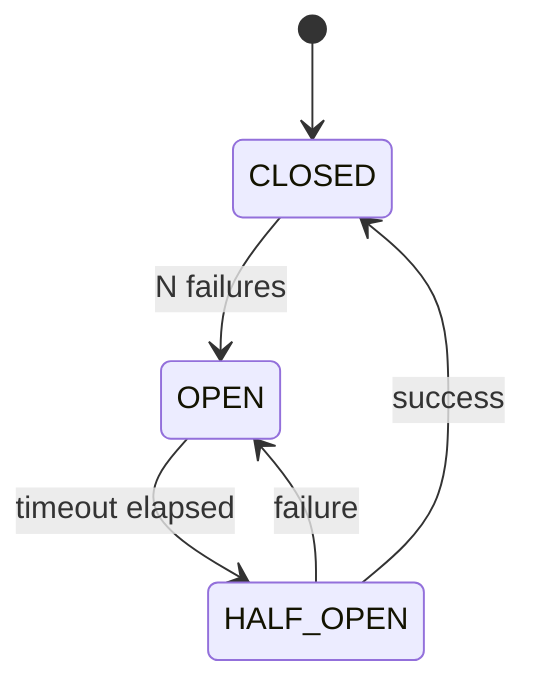

### 3.9 RuntimeEventBus & RuntimeObservability (HOS-013)

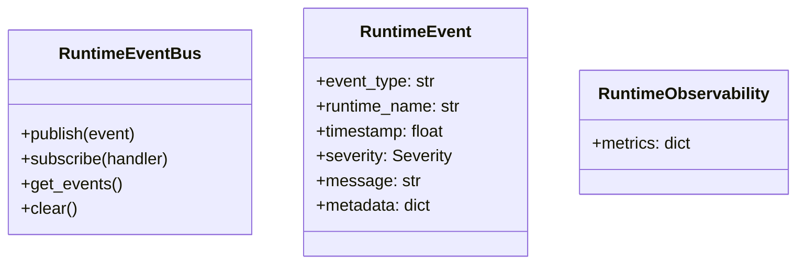

### 3.10 RuntimePerformanceAnalyzer (HOS-014)

Analyse les événements pour produire :

- `success_rate`
- `reliability_score` (0-100)
- `performance_score` (0-100)
- Classement des runtimes

### 3.11 RuntimeDecisionEngine (HOS-015)

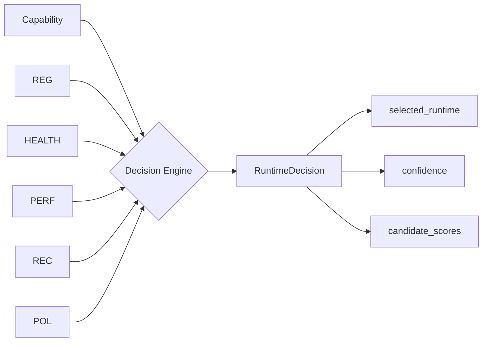

Score composite (0-1000) : Health + Reliability + Performance + Capability + Policy - CircuitPenalty.

### 3.12 RuntimePolicyEngine (HOS-016)

Règles extensibles pour contrôler :

- Runtimes autorisés par contexte
- Préférences local/cloud
- Priorités par type de tâche

---

## 4. Agent Layer (HOS-017 → HOS-020, HOS-024)

### 4.1 ExecutionGraph (HOS-017)

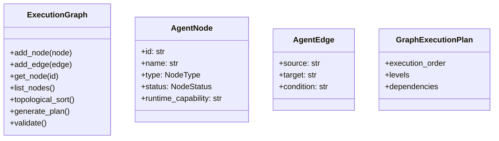

DAG thread-safe avec détection de cycles, validation, plan d'exécution.

### 4.2 TaskPlanner (HOS-018)

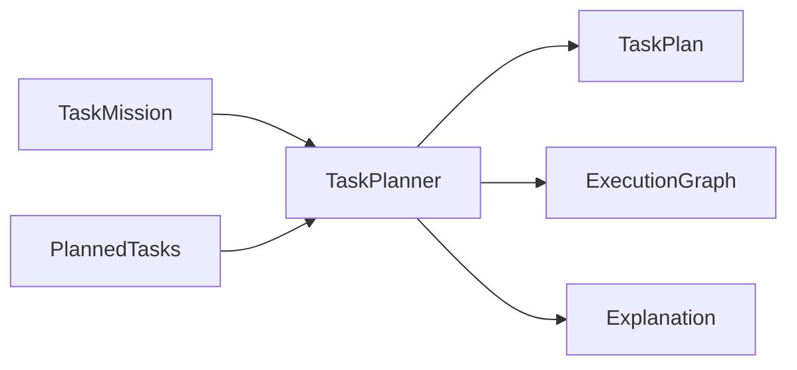

4 stratégies : `SEQUENTIAL`, `BALANCED`, `PARALLEL`, `CONSERVATIVE`.

### 4.3 AgentLifecycleManager (HOS-019)

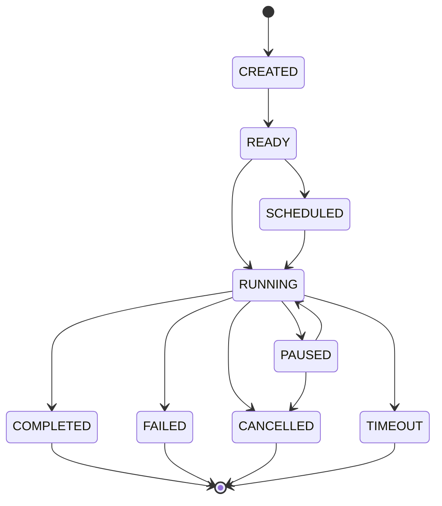

Machine à états thread-safe avec callback `on_event(agent_id, from_state, to_state)`.

### 4.4 MultiAgentSupervisor (HOS-020)

```mermaid
flowchart LR
    M[MissionContext] --> SUP[MultiAgentSupervisor]
    T[PlannedTasks] --> SUP
    SUP --> PLAN[TaskPlan]
    SUP --> INST[AgentInstances]
    SUP --> TICK[tick()]
    PLAN --> EG[ExecutionGraph]
    EG --> TICK
    TICK --> AGENT[create → start → complete]
```

### 4.5 ExecutionEngine (HOS-024)

Moteur d'exécution complet :

```
start(mission, tasks) → ExecutionContext
tick() → description des changements
pause() / resume() / cancel() / recover()
get_status() → snapshot d'avancement
get_result() → ExecutionResult
```

---

## 5. Memory Layer (HOS-021)

### 5.1 UnifiedMemory

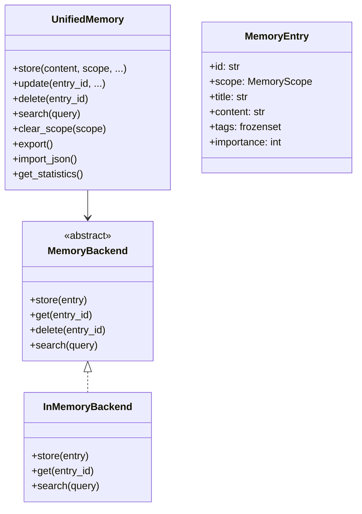

7 scopes : `SESSION`, `MISSION`, `AGENT`, `PROJECT`, `USER`, `GLOBAL`, `EXPERIENCE`.

---

## 6. Skill Layer (HOS-022)

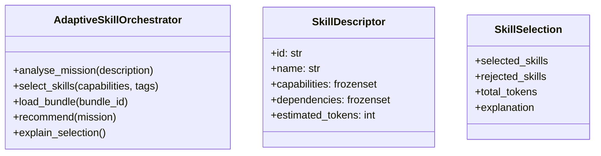

4 stratégies : `MINIMAL`, `BALANCED`, `EXHAUSTIVE`, `PERFORMANCE`.

---

## 7. Event Layer (HOS-025)

### 7.1 SystemEventBus

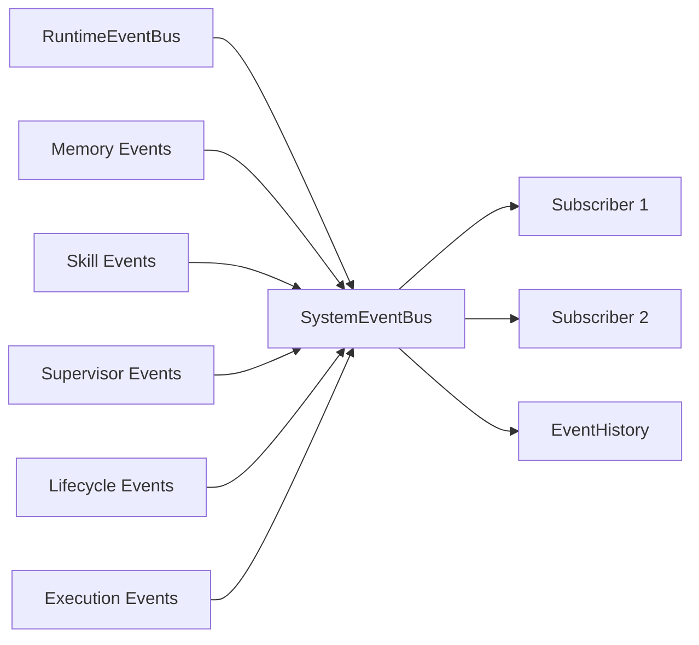

9 familles : `RUNTIME`, `AGENT`, `MISSION`, `EXECUTION`, `MEMORY`, `SKILL`, `SYSTEM`, `OBSERVABILITY`, `INTEGRATION`.

---

## 8. Mission Control (HOS-027/028)

### 8.1 MissionControlService

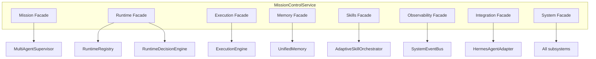

### 8.2 Routes API (HOS-028)

Toutes les routes sous `/api/v1/` :

| Groupe | Méthodes |
|---|---|
| Missions | `GET/POST /missions`, `GET /missions/{id}`, `POST /missions/{id}/{start,pause,resume,cancel}` |
| Runtimes | `GET /runtimes`, `GET /runtimes/{health,metrics}`, `GET /runtimes/{name}[/{health,metrics}]` |
| Execution | `GET /execution`, `POST /execution/{start,pause,resume,cancel}` |
| Memory | `GET/POST /memory`, `GET/PATCH /memory/{entry_id}`, `GET /memory/{search,statistics}` |
| Skills | `GET /skills`, `POST /skills/{select,recommend}`, `GET /skills/statistics`, `POST /skills/bundles/{id}/load` |
| Events | `GET /events`, `GET /events/{statistics,export}`, `POST /events/{publish,clear}` |
| Hermes | `GET /hermes/{status,sessions}`, `POST /hermes/{connect,disconnect,task}` |
| System | `GET /{health,status,diagnostics,statistics,version}`, `POST /tick` |
| WebSocket | `ws://host/ws/events` — streaming SystemEvent |

---

## 9. Intégrations

### 9.1 HermesAgentAdapter (HOS-023)

Pont entre Hermes OS et Hermes Agent (NousResearch) :

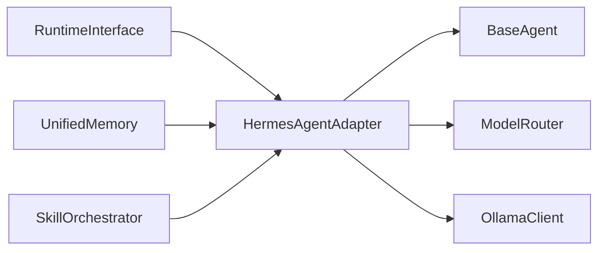

Mapping : `RuntimeDecision → ModelRouter`, `UnifiedMemory → EchoAgent.remember()`, `TaskPlan → Hermes Tasks`.

---

## 10. Flux d'exécution typique

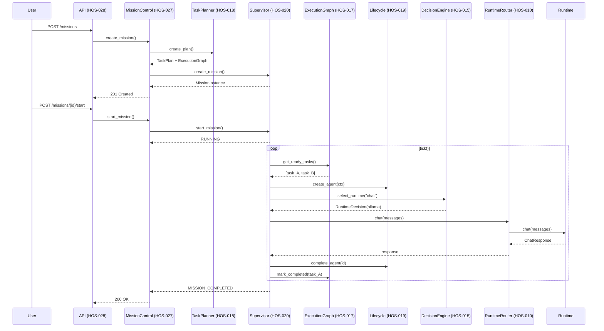

---

## 11. Dépendances entre modules

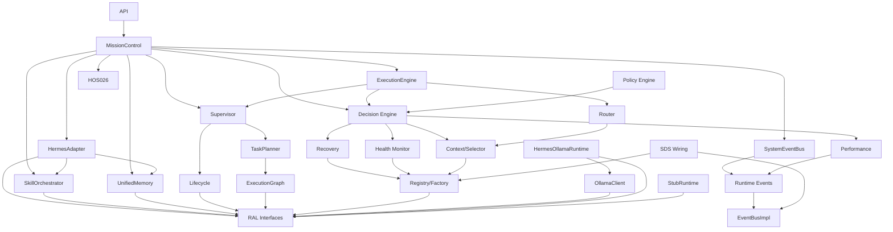
