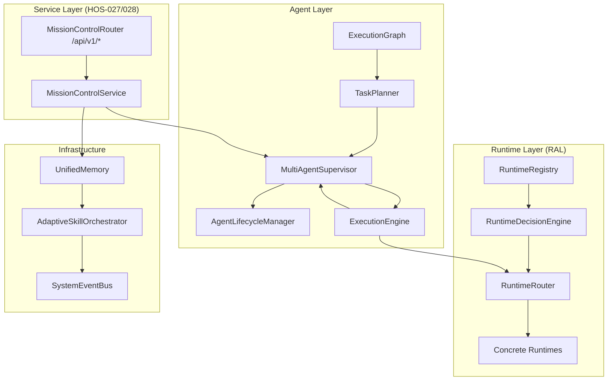

# Hermes OS

> **Système d'exploitation pour agents IA** — modulaire, extensible, open-source.
> Orchestre, exécute et supervise des missions multi-étapes sur des backends IA hétérogènes (Ollama, OpenAI, Anthropic, vLLM…).

[]()
[]()
[]()
[]()

---

## 🚀 Quickstart

```bash
# 1. Backend
python3.11 -m venv .venv && source .venv/bin/activate
pip install -r backend/requirements.txt
cp .env.example .env   # Configurer ALLOWED_PATHS
uvicorn backend.main:app --reload --host 0.0.0.0 --port 8000

# 2. Tester (sans GPU/Ollama)
pytest

# 3. Ollama
curl -fsSL https://ollama.com/install.sh | sh
ollama pull qwen3.5:9b

# 4. Frontend (Next.js)
cd frontend && pnpm install && cp .env.local.example .env.local && pnpm dev
```

---

## 📋 Table des matières

- [Vision](#vision)
- [Architecture](#architecture)
- [Modules](#modules)
- [API](#api)
- [Intégrations](#intégrations)
- [Documentation](#documentation)
- [Roadmap](#roadmap)
- [Installation](#installation)
- [Contribuer](#contribuer)

---

## Vision

Hermes OS est un **système d'exploitation pour agents IA**, pas un simple chatbot. Il gère :

- **Runtimes** — backends IA abstraits (Ollama, OpenAI, Anthropic…)
- **Agents** — processus de travail transients ou persistants
- **Mémoire** — structurée, scopée, requêtable
- **Exécution** — orchestration de tâches en DAG avec reprise
- **Événements** — bus central reliant tous les sous-systèmes

> 📖 [VISION.md](VISION.md) — Philosophie complète, principes d'architecture et vision long-terme.

---

## Architecture



| Couche | Responsabilité | HOS |
|---|---|---|
| **RAL** | Abstraction runtime, décision, health, recovery | 004→016 |
| **Agent** | Graphe d'exécution, planification, cycle de vie, supervision | 017→020, 024 |
| **Mémoire** | Stockage unifié avec backend pluggable | 021 |
| **Skills** | Orchestrateur adaptatif de compétences | 022 |
| **Événements** | Bus central pub/sub | 013, 025 |
| **Services** | Façade MissionControlService | 027 |
| **API** | REST + WebSocket | 028 |
| **Intégrations** | HermesAgentAdapter, FreebuffAdapter | 023, 026 |

> 📖 [ARCHITECTURE.md](ARCHITECTURE.md) — Documentation complète avec tous les diagrammes Mermaid.

---

## Modules

### Runtime Abstraction Layer (HOS-004 à HOS-016)

| Module | Responsabilité |
|---|---|
| `RuntimeInterface` | Contrat Protocol pour tout runtime IA |
| `RuntimeRegistry` | Registre thread-safe de runtimes |
| `RuntimeSelector` | Sélection par capacités |
| `ActiveRuntimeContext` | Contexte de runtime actif + fallback |
| `RuntimeRouter` | Routage avec recovery automatique |
| `RuntimeHealthMonitor` | Santé : AVAILABLE / DEGRADED / UNAVAILABLE |
| `RuntimeRecoveryManager` | Circuit breaker : CLOSED → OPEN → HALF_OPEN |
| `RuntimePerformanceAnalyzer` | Scores de fiabilité et performance (0-100) |
| `RuntimeDecisionEngine` | Score composite 0-1000 pour sélection |
| `RuntimePolicyEngine` | Règles métier extensibles |

### Agent Layer (HOS-017 à HOS-024)

| Module | Responsabilité |
|---|---|
| `ExecutionGraph` | DAG thread-safe avec tri topologique |
| `TaskPlanner` | 4 stratégies de planification |
| `AgentLifecycleManager` | Machine à états (10 états) |
| `MultiAgentSupervisor` | Orchestration missions + agents |
| `ExecutionEngine` | Moteur d'exécution complet |

### Infrastructure

| Module | Responsabilité |
|---|---|
| `UnifiedMemory` | Mémoire 7 scopes, backend abstrait, import/export |
| `AdaptiveSkillOrchestrator` | 4 stratégies de sélection, bundles |
| `SystemEventBus` | Bus central pub/sub, 9 familles d'événements |

---

## API

Tous les endpoints REST sous `/api/v1/`, WebSocket à `/ws/events`.

| Groupe | Endpoints |
|---|---|
| **Missions** | `GET/POST /missions`, `GET /missions/{id}`, `POST /missions/{id}/{start,pause,resume,cancel}` |
| **Runtimes** | `GET /runtimes[/health|/metrics]`, `GET /runtimes/{name}[/{health,metrics}]` |
| **Execution** | `GET /execution`, `POST /execution/{start,pause,resume,cancel}` |
| **Memory** | `GET/POST /memory`, `GET/PATCH /memory/{entry_id}`, `GET /memory/{search,statistics}` |
| **Skills** | `GET /skills`, `POST /skills/{select,recommend}`, `GET /skills/statistics` |
| **Events** | `GET /events`, `GET /events/{statistics,export}`, `POST /events/{publish,clear}` |
| **System** | `GET /{health,status,diagnostics,statistics,version}`, `POST /tick` |
| **Freebuff** | `GET/POST /freebuff/projects`, `POST /freebuff/sync` |
| **Hermes** | `GET /hermes/{status,sessions}`, `POST /hermes/{connect,disconnect,task}` |
| **WebSocket** | `ws://host/ws/events` — streaming temps réel |

---

## Intégrations

### Hermes Agent (HOS-023)

Pont complet entre Hermes OS et [Hermes Agent](https://github.com/NousResearch/hermes-agent) (NousResearch).

Mapping : `RuntimeDecision → ModelRouter`, `UnifiedMemory → EchoAgent`, `TaskPlan → Hermes Tasks`.

### Freebuff (HOS-026)

Pont avec Freebuff pour planification avancée :
`Mission → FreebuffPrompt → FreebuffResponse → TaskPlan → ExecutionGraph → Supervisor`

### Futures intégrations prévues

- Alexandrie (memory backend distribué)
- KTransformers (optimisation inférence)
- Homelable (déploiement)
- OpenAI / Anthropic / vLLM (runtimes additionnels)

---

## Documentation

| Document | Description |
|---|---|
| [VISION.md](VISION.md) | Philosophie, objectifs, principes |
| [ARCHITECTURE.md](ARCHITECTURE.md) | Architecture complète avec diagrammes |
| [DESIGN_DECISIONS.md](DESIGN_DECISIONS.md) | Choix architecturaux et alternatives |
| [ROADMAP.md](ROADMAP.md) | HOS terminés, en cours, futurs |
| [CHANGELOG.md](CHANGELOG.md) | Toutes les modifications par HOS |
| [CONTRIBUTING.md](CONTRIBUTING.md) | Guide développeur |
| [CAHIER_DES_CHARGES_HERMES_OLLAMA.md](CAHIER_DES_CHARGES_HERMES_OLLAMA.md) | Spécification fonctionnelle complète |
| [AUDIT_CONFORMITE.md](AUDIT_CONFORMITE.md) | Audit de conformité v4.0 |
| `docs/` | Documentation organisée par thème |

---

## Roadmap

```
✅ HOS-000 à HOS-003 — Fondation SDS
✅ HOS-004 à HOS-016 — Runtime Abstraction Layer (RAL)
✅ HOS-017 à HOS-024 — Agent Layer
✅ HOS-025 à HOS-028 — Services, Intégrations, API
📅 HOS-029 — Frontend Next.js (Dashboard)
📅 HOS-030 — Connexion Alexandrie
📅 HOS-031 — Persistance SQLite
🔮 HOS-033+ — OpenAI, Anthropic, vLLM
```

> 📖 [ROADMAP.md](ROADMAP.md) — Détail complet avec diagramme Gantt.

---

## Installation détaillée

### Backend

```bash
git clone <url>
cd backend
python3.11 -m venv .venv
source .venv/bin/activate
pip install -r backend/requirements.txt
cp .env.example .env
# Éditer .env : ALLOWED_PATHS, configuration
uvicorn backend.main:app --reload --host 0.0.0.0 --port 8000
```

### Tests

```bash
pytest                                    # 693 tests, sans GPU
pytest tests/architecture/                # Tests d'architecture pure
pytest tests/api/                         # Tests API REST + WebSocket
python3 -m compileall backend tests       # Vérification compilation
```

### Configuration

- `config/models.yaml` — matrice de routage des modèles
- `config/agents.yaml` — registre des agents
- `.env` — configuration matérielle et sécurité

---

## Projet legacy — Hermes Ollama

Le projet inclut également la stack **Hermes Ollama** originale : agents Aegis (sécurité), Atlas (fichiers), Echo (mémoire), Kronos (tâches), Minerva (recherche), Veritas (QA), Scribe (documentation), Eyes (vision), Swift (classification).

Cette stack coexiste avec la nouvelle architecture Hermes OS (HOS-009→028) et continue d'être maintenue.

> Voir [AUDIT_CONFORMITE.md](AUDIT_CONFORMITE.md) pour l'audit complet de conformité au cahier des charges v4.0.

---

## Layout du projet

```
backend/
├── api/              # HOS-028 — Mission Control API
├── agent/            # HOS-017→024 — Agent Layer
├── ral/              # HOS-004→016 — Runtime Abstraction Layer
├── memory/           # HOS-021 — Unified Memory
├── skills/           # HOS-022 — Skill Orchestrator
├── events/           # HOS-025 — System Event Bus
├── integrations/     # HOS-023, 026 — Hermes Agent, Freebuff
├── services/         # HOS-027 — Mission Control Service
├── app/              # Legacy Hermes Ollama
├── core/             # Legacy
├── agents/           # Legacy (Aegis, Echo, Kronos…)
├── connectors/       # Legacy
├── mcp_server/       # Legacy MCP
├── monitoring/       # Legacy
├── workflows/        # Legacy
├── self_evolution/   # Legacy HSE
├── memory/           # Legacy (episodic, semantic)
├── sds/              # Legacy SDS
└── main.py           # Point d'entrée FastAPI

frontend/             # Next.js (minimal Chat)
config/               # models.yaml, agents.yaml
docs/                 # Documentation organisée
```
