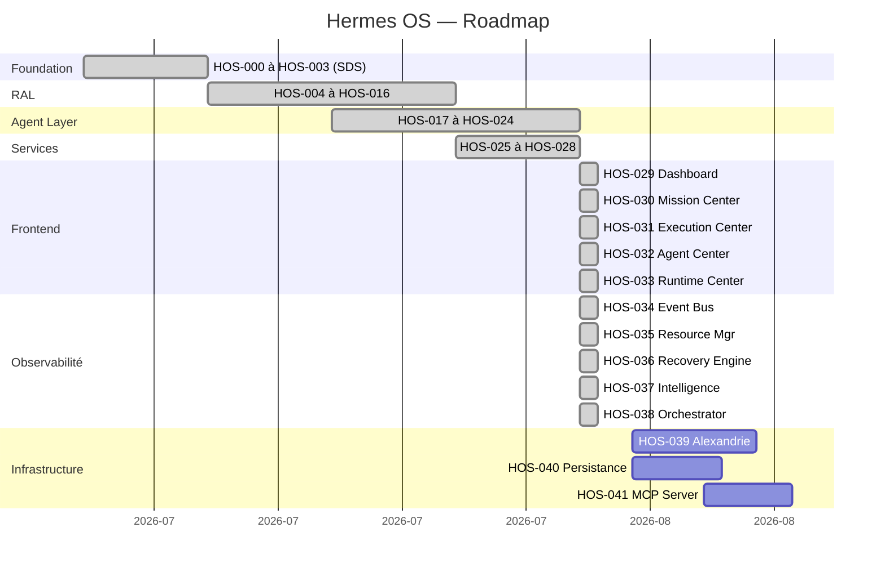

# Roadmap — Hermes OS

> **État d'avancement réel du projet après HOS-065B.**
> Chaque HOS est incrémental et préserve la compatibilité avec les précédents.

---

## P-002 — Namespace d'API unifié ✅ (2026-07-30)

Le Cockpit n'utilise plus qu'une seule racine `/api/v1`. Les 74 endpoints
hérités y sont republiés ; aucune capacité n'est joignable uniquement hors du
namespace. Actions destructives protégées par confirmation.

**Reste à trancher**
- Retrait des 62 chemins racine conservés pour compatibilité (cycle de dépréciation).
- Schéma OpenAPI de `POST /verification/run` — débloquerait le bouton du Validation Center.
- Homonymie `/skills` historique vs HOS : renommage ou maintien de `/api/v1/legacy`.

## Statut Release Candidate

> ### 🔴 Audit RC2 du 2026-07-30 → NO GO pour v1.0 (score 71/100)
>
> Rapport : [`docs/release/HERMES_OS_RC2_AUDIT.md`](docs/release/HERMES_OS_RC2_AUDIT.md)
>
> **La plateforme est solide ; la capacité centrale n'est pas implémentée.**
> Aucun chemin d'exécution n'effectue de travail réel :
> `AutonomousOrchestrator` étape 4 est `random.random() > 0.15`, les nœuds de
> mission ne progressent jamais (`_execute_via_hermes` est un placeholder
> documenté), l'adaptateur KTransformers est simulé (`is_real_kt: false`) et le
> client MCP sortant renvoie un succès fabriqué sans aucune I/O. Six requêtes
> identiques ont produit des succès alternés et six durées aléatoires ; Ollama
> tournait avec 16 modèles et n'a jamais été invoqué.
>
> **Aucune fonctionnalité ne doit être annoncée comme autonome tant que R-1
> n'est pas résolu.** 12 défauts ont été corrigés pendant l'audit (évasion de
> sandbox, 22 endpoints en 500, 8 topics perdus, santé 864 ms → 0,8 ms).
> 3 341 tests passent, 0 échec.

> ### ✅ R-001 du 2026-07-30 — R-1 levé pour les objectifs mono-tâche
>
> Inventaire et justifications :
> [`docs/release/R-001_SIMULATION_INVENTORY.md`](docs/release/R-001_SIMULATION_INVENTORY.md)
>
> L'exécution est réelle : `random.random() > 0.15` et
> `"Simulated result for: …"` remplacés par `RealTaskExecutor`, qui appelle un
> vrai runtime, mesure la durée au `perf_counter`, compte les jetons et **lève
> `RuntimeUnavailableError` plutôt que de fabriquer un succès**. MCP effectue un
> vrai JSON-RPC HTTP (`connected` signifie connecté). Vérifié : durée rapportée
> à 0,1 % de l'horloge murale, `runtimes_used=["ollama"]` mesuré, `qwen3:4b`
> effectivement chargé côté Ollama, 3 requêtes identiques déterministes.
>
> **Reste 9 points justifiés** (§6 de l'inventaire) : vLLM et llama.cpp sans
> adaptateur, `kt_kernel` non installable, boucles d'outils par agent, artefacts
> de workspace, profondeur de validation, diffusion mémoire. La décomposition
> multi-tâches attend J-3 : le `DecisionEngine` produit des décisions de
> *sélection*, pas un découpage en sous-tâches.

**Audit RC1 du 2026-07-29 → 🔴 NO GO** (score 65/100) —
[`docs/release/HERMES_OS_RC1_AUDIT.md`](docs/release/HERMES_OS_RC1_AUDIT.md).

**HOS-066B du 2026-07-30 — assemblage : les 5 anomalies critiques sont levées.**
Architecture : [`docs/architecture/COMPOSITION_ROOT_ARCHITECTURE.md`](docs/architecture/COMPOSITION_ROOT_ARCHITECTURE.md) ·
Graphe : [`docs/architecture/DEPENDENCY_REPORT.md`](docs/architecture/DEPENDENCY_REPORT.md)

Le diagnostic de l'audit était que les sous-systèmes étaient complets mais que
**rien ne les assemblait** : les points d'injection prévus par le code
(`create_*_routes(service)`, `configure(...)`, `IntegrationManager`) n'étaient
jamais appelés en production. Le composition root les appelle désormais.

| Réf. | Anomalie critique | Statut |
|---|---|---|
| C-1 | Aucun composition root → 16 endpoints en `503` | ✅ **32/32 sous-systèmes instanciés, 0 × 5xx** |
| C-2 | 9 sous-systèmes sans surface HTTP | ✅ **`APIRouter` délégant aux handlers existants** |
| C-3 | Deux namespaces API divergents | ⚠️ **partiellement** — préfixe unifié, mais 39 chemins appelés par `lib/*` restent en 404 (voir RC2 R-2) |
| C-4 | 8 Centers du Cockpit inatteignables | ⚠️ **17/17 ids de sidebar résolvent**, mais l'Installer Center n'existe pas (RC2 R-5) |
| C-5 | `/mcp` en `421` derrière Docker/nginx | ✅ **hôtes de déploiement autorisés, rebinding conservé** |
| M-2 | `EventHub` rejetait 26/28 topics ; dispatch WS cassé | ✅ **179 topics, publication permissive, `run_coroutine_threadsafe`** |

### Phase 9 — Reste à traiter avant v1.0 (📅)

| Réf. | Action | Priorité |
|---|---|---|
| M-9 | `pytest.ini` : `testpaths = backend/tests tests` (la CI n'exécute que 24 % des tests) | 🟠 Majeure |
| M-1 | Modèles Pydantic sur les 19 corps `dict = Body(...)` (500 → 422) | 🟠 Majeure |
| M-7 | Consolider les 6 duplications (`agent`/`agents`, `evolution`/`self_evolution`, 2 registries…) | 🟠 Majeure |
| M-13 | Borner `mcp<2` dans `requirements.txt` (la 1.26 a introduit la protection DNS-rebinding) | 🟠 Majeure |
| M-8 | Persister et borner `mission/routes.py::_missions` (dict module-level sans verrou) | 🟠 Majeure |
| M-3 | Installer Center : implémenter ou retirer du périmètre annoncé | 🟡 Mineure |
| M-6 | Câbler les 4 adaptateurs HOS-065B et `approval_explainer` (testés, jamais utilisés) | 🟡 Mineure |
| cos-1 | Supprimer les 321 imports inutilisés et les 15 composants frontend morts | ⚪ Cosmétique |
| J-3 | Boucles d'outils par agent spécialisé (KlaatCode indexation, OhMyPi LSP) — prérequis de la décomposition multi-tâches | 🟠 Majeure |
| J-2 | Adaptateurs vLLM et llama.cpp (aujourd'hui `RuntimeUnavailableError`) | 🟠 Majeure |
| J-4 | Câbler le `WorkspaceManager` dans l'exécuteur pour des artefacts sur disque | 🟡 Mineure |
| J-5 | Validation réelle de syntaxe/politique/sécurité des sorties générées | 🟡 Mineure |
| J-6 | Diffuser les résultats vers les 5 couches de mémoire | 🟡 Mineure |

---

## Légende

- ✅ **Terminé** — code + tests + documentation
- 🔄 **En cours** — implémentation active
- 📅 **Planifié** — spécifié, pas encore commencé
- 🔮 **Futur** — identifié, non spécifié

---

## Phase 1 — Fondation (HOS-000 à HOS-003) ✅

| HOS | Description | Statut |
|---|---|---|
| HOS-000 | Foundation (SDS) : EventBusImpl, RuntimeHolder singleton, FastAPI wiring | ✅ |
| HOS-001 | RAL Interfaces : RuntimeInterface Protocol, ChatCapability, CapabilitySet | ✅ |
| HOS-002 | EventBusImpl : bus SQLite publish/subscribe | ✅ |
| HOS-003 | SDS Wiring : routes `/api/hermes-os/*`, legacy EventHub forward | ✅ |

Tests : 48/48

---

## Phase 2 — Runtime Abstraction Layer (HOS-004 à HOS-016) ✅

| HOS | Description | Statut |
|---|---|---|
| HOS-004 | StubRuntime : premier runtime de démonstration | ✅ |
| HOS-005 | HermesOllamaRuntime : runtime agentique Ollama | ✅ |
| HOS-006 | OllamaClient : Protocol + client HTTP + fake client | ✅ |
| HOS-007 | RuntimeRegistry & RuntimeFactory | ✅ |
| HOS-008 | SDS Runtime wiring : init_runtime_registry_in_holder | ✅ |
| HOS-009 | ActiveRuntimeContext & RuntimeSelector | ✅ |
| HOS-010 | RuntimeRouter : exécution avec fallback | ✅ |
| HOS-011 | RuntimeHealthMonitor : AVAILABLE/DEGRADED/UNAVAILABLE | ✅ |
| HOS-012 | RuntimeRecoveryManager & CircuitBreaker | ✅ |
| HOS-013 | RuntimeEventBus & RuntimeObservability | ✅ |
| HOS-014 | RuntimePerformanceAnalyzer : scores et classement | ✅ |
| HOS-015 | RuntimeDecisionEngine : score composite 0-1000 | ✅ |
| HOS-016 | RuntimePolicyEngine : règles et priorités | ✅ |

Tests RAL : ~200

---

## Phase 3 — Agent Layer (HOS-017 à HOS-024) ✅

| HOS | Description | Statut |
|---|---|---|
| HOS-017 | ExecutionGraph : DAG thread-safe avec tri topologique | ✅ |
| HOS-018 | TaskPlanner : 4 stratégies, validation, explication | ✅ |
| HOS-019 | AgentLifecycleManager : machine à états 10 états | ✅ |
| HOS-020 | MultiAgentSupervisor : orchestration missions + agents | ✅ |
| HOS-021 | UnifiedMemory : 7 scopes, MemoryBackend abstrait | ✅ |
| HOS-022 | AdaptiveSkillOrchestrator : 4 stratégies de sélection | ✅ |
| HOS-023 | HermesAgentAdapter : pont Hermes OS → Hermes Agent | ✅ |
| HOS-024 | ExecutionEngine : moteur d'exécution complet | ✅ |

Tests Agent : ~250

---

## Phase 4 — Services & Intégrations (HOS-025 à HOS-028) ✅

| HOS | Description | Statut |
|---|---|---|
| HOS-025 | SystemEventBus : bus central pub/sub unifié | ✅ |
| HOS-026 | FreebuffAdapter : intégration Freebuff | ✅ |
| HOS-027 | MissionControlService : façade centrale unifiée | ✅ |
| HOS-028 | Mission Control API : routes REST + WebSocket | ✅ |

Tests totaux : ~693

---

## Phase 5 — Frontend (HOS-029) ✅

| HOS | Description | Statut |
|---|---|---|
| HOS-029 | Frontend Next.js — Dashboard Mission Control | ✅ |

---

## Phase 6 — Observabilité & Événements (HOS-034 — HOS-037) ✅

| HOS | Description | Statut |
|---|---|---|
| HOS-034 | Runtime Event Bus & Observability — 24 tests, WebSocket temps réel | ✅ |
| HOS-035 | Runtime Resource Manager — 21 tests, allocation VRAM/RAM, thresholds | ✅ |
| HOS-036 | Runtime Recovery Engine — 25 tests, policies, actions, cooldown | ✅ |
| HOS-037 | Runtime Intelligence Layer — 26 tests, scoring, recommendations | ✅ |

---

## Phase 7 — À venir (📅 Planifié)

| HOS | Description | Priorité |
|---|---|---|
| HOS-036 | Connexion Alexandrie (Memory Backend distribué) | Moyenne |
| HOS-037 | Persistance SQLite pour Event Bus & UnifiedMemory | Haute |
| HOS-038 | MCP Server enrichi — exposition de tous les services | Moyenne |

---

## Phase 8 — Futur (🔮)

| HOS | Description |
|---|---|
| HOS-038 | Support OpenAI / Anthropic comme runtimes additionnels |
| HOS-039 | Support vLLM comme runtime |
| HOS-040 | Authentification & permissions multi-utilisateur |
| HOS-041 | Rate limiting & quotas |
| HOS-042 | Scheduler distribué |
| HOS-043 | Homelable intégration |
| HOS-044 | KTransformers support |
| HOS-045 | GraphQL API |
| HOS-046 | SDK Python public |

---

## Résumé des jalons

---

## Métriques projet

> Mesuré sur le dépôt le 2026-07-29 (audit RC1). Les valeurs précédentes de ce
> tableau étaient très en retard sur le code réel (elles annonçaient ~18 000 lignes
> pour ~118 000, et ~693 tests pour 3 133) et deux lignes étaient malformées.

| Métrique | Valeur |
|---|---|
| HOS complétés | 65 (HOS-000 à HOS-065B ; HOS-059/060/061 non attribués) |
| Tests `tests/` (architecture, API, intégrations, sécurité, production) | 2 497 |
| Tests `backend/tests/` (legacy Hermes) | 796 |
| Tests frontend (vitest) | 65 |
| **Total tests** | **3358** (tous passants) |
| Fichiers source Python | 480 modules (~104 400 lignes) |
| Fichiers source TypeScript | 102 fichiers (~13 750 lignes) |
| **Lignes de code** | **~118 000** |
| Sous-systèmes backend | 35 (voir la matrice de dépendances du rapport RC1) |
| Routes HTTP servies | **255 chemins distincts** (189 sous `/api/v1`, 60 legacy, `/mcp`) |
| Sous-systèmes assemblés au démarrage | **32 / 32** (100 %), 30 routeurs liés |
| Topics d'événements acceptés | 143 |
| Pages frontend | 11 routes Next.js ; **17 Centers atteignables sur 17** |
