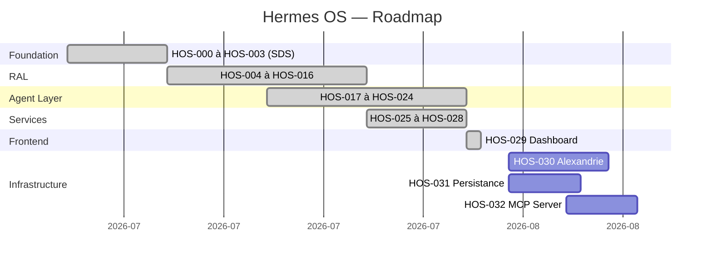

# Roadmap — Hermes OS

> **État d'avancement réel du projet après HOS-028.**
> Chaque HOS est incrémental et préserve la compatibilité avec les précédents.

---

## Légende

- ✅ **Terminé** — code + tests + documentation
- 🔄 **En cours** — implémentation active
- 📅 **Planifié** — spécifié, pas encore commencé
- 🔮 **Futur** — identifié, non spécifié

---

## Phase 1 — Fondation (HOS-000 à HOS-003) ✅

| HOS | Description | Statut |
|---|---|---|
| HOS-000 | Foundation (SDS) : EventBusImpl, RuntimeHolder singleton, FastAPI wiring | ✅ |
| HOS-001 | RAL Interfaces : RuntimeInterface Protocol, ChatCapability, CapabilitySet | ✅ |
| HOS-002 | EventBusImpl : bus SQLite publish/subscribe | ✅ |
| HOS-003 | SDS Wiring : routes `/api/hermes-os/*`, legacy EventHub forward | ✅ |

Tests : 48/48

---

## Phase 2 — Runtime Abstraction Layer (HOS-004 à HOS-016) ✅

| HOS | Description | Statut |
|---|---|---|
| HOS-004 | StubRuntime : premier runtime de démonstration | ✅ |
| HOS-005 | HermesOllamaRuntime : runtime agentique Ollama | ✅ |
| HOS-006 | OllamaClient : Protocol + client HTTP + fake client | ✅ |
| HOS-007 | RuntimeRegistry & RuntimeFactory | ✅ |
| HOS-008 | SDS Runtime wiring : init_runtime_registry_in_holder | ✅ |
| HOS-009 | ActiveRuntimeContext & RuntimeSelector | ✅ |
| HOS-010 | RuntimeRouter : exécution avec fallback | ✅ |
| HOS-011 | RuntimeHealthMonitor : AVAILABLE/DEGRADED/UNAVAILABLE | ✅ |
| HOS-012 | RuntimeRecoveryManager & CircuitBreaker | ✅ |
| HOS-013 | RuntimeEventBus & RuntimeObservability | ✅ |
| HOS-014 | RuntimePerformanceAnalyzer : scores et classement | ✅ |
| HOS-015 | RuntimeDecisionEngine : score composite 0-1000 | ✅ |
| HOS-016 | RuntimePolicyEngine : règles et priorités | ✅ |

Tests RAL : ~200

---

## Phase 3 — Agent Layer (HOS-017 à HOS-024) ✅

| HOS | Description | Statut |
|---|---|---|
| HOS-017 | ExecutionGraph : DAG thread-safe avec tri topologique | ✅ |
| HOS-018 | TaskPlanner : 4 stratégies, validation, explication | ✅ |
| HOS-019 | AgentLifecycleManager : machine à états 10 états | ✅ |
| HOS-020 | MultiAgentSupervisor : orchestration missions + agents | ✅ |
| HOS-021 | UnifiedMemory : 7 scopes, MemoryBackend abstrait | ✅ |
| HOS-022 | AdaptiveSkillOrchestrator : 4 stratégies de sélection | ✅ |
| HOS-023 | HermesAgentAdapter : pont Hermes OS → Hermes Agent | ✅ |
| HOS-024 | ExecutionEngine : moteur d'exécution complet | ✅ |

Tests Agent : ~250

---

## Phase 4 — Services & Intégrations (HOS-025 à HOS-028) ✅

| HOS | Description | Statut |
|---|---|---|
| HOS-025 | SystemEventBus : bus central pub/sub unifié | ✅ |
| HOS-026 | FreebuffAdapter : intégration Freebuff | ✅ |
| HOS-027 | MissionControlService : façade centrale unifiée | ✅ |
| HOS-028 | Mission Control API : routes REST + WebSocket | ✅ |

Tests totaux : ~693

---

## Phase 5 — Frontend (HOS-029) ✅

| HOS | Description | Statut |
|---|---|---|
| HOS-029 | Frontend Next.js — Dashboard Mission Control | ✅ |

---

## Phase 6 — À venir (📅 Planifié)

| HOS | Description | Priorité |
|---|---|---|
| HOS-030 | Connexion Alexandrie (Memory Backend distribué) | Moyenne |
| HOS-031 | Persistance SQLite pour Event Bus & UnifiedMemory | Haute |
| HOS-032 | MCP Server enrichi — exposition de tous les services | Moyenne |

---

## Phase 7 — Futur (🔮)

| HOS | Description |
|---|---|
| HOS-033 | Support OpenAI / Anthropic comme runtimes additionnels |
| HOS-034 | Support vLLM comme runtime |
| HOS-035 | Authentification & permissions multi-utilisateur |
| HOS-036 | Rate limiting & quotas |
| HOS-037 | Scheduler distribué |
| HOS-038 | Homelable intégration |
| HOS-039 | KTransformers support |
| HOS-040 | GraphQL API |
| HOS-041 | SDK Python public |

---

## Résumé des jalons

---

## Métriques projet

| Métrique | Valeur |
|---|---|
| HOS complétés | 30 (HOS-000 à HOS-029) |
| Tests d'architecture | 630+ |
| Tests intégrations | 63+ |
| Total tests | ~693 |
| Fichiers source Python | ~60 |
| Fichiers source TypeScript | ~25 |
| Lignes de code | ~18 000+ |
| Modules backend | backend/, backend/ral/, backend/agent/, backend/memory/, backend/skills/, backend/events/, backend/services/, backend/api/, backend/integrations/ |
| Pages frontend | 10 (dashboard, missions, runtimes, agents, memory, skills, events, settings, chat, +)_ |
