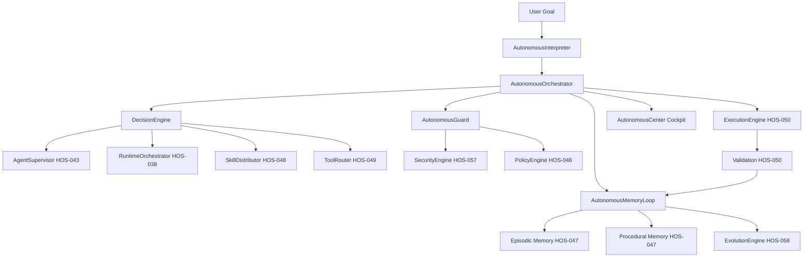

# Hermes OS — Autonomous Agentic Core

## HOS-063 — Final Layer

---

## 1. Overview

The Autonomous Agentic Core is the final orchestration layer of Hermes OS. It transforms a human goal into a fully autonomous execution pipeline that plans, selects agents, runtimes, tools, skills, validates through security, executes, learns, and improves future decisions.

### Design Principles

- **Orchestration, not replacement** — Uses all existing HOS subsystems, never duplicates them
- **Defense in Depth** — Every action passes through Security Engine, Policy Engine, and Autonomous Guard
- **Continuous Learning** — Every mission feeds Episodic Memory, Procedural Memory, and Evolution Engine
- **Full Observability** — Every decision is logged with confidence score, alternatives, and reasoning

---

## 2. Architecture



---

## 3. Pipeline (8 Steps)

```
1. RECEIVE   — Goal received from user
2. ANALYZE   — Goal interpreted (domain, language, constraints, complexity)
3. PLAN      — Decisions made (agents, runtime, tools, skills)
4. SELECT    — Best options chosen with confidence scoring
5. EXECUTE   — Goal executed through security-validated pipeline
6. VALIDATE  — Results validated
7. LEARN     — Outcomes stored in memory + evolution
8. REPORT    — Final report generated
```

---

## 4. Components

### 4.1 AutonomousInterpreter

Transforms human language into structured goals using keyword analysis:

| Domain | Keywords |
|---|---|
| web | web, app, frontend, site, interface, ui, dashboard |
| backend | api, service, server, backend, endpoint, rest |
| data | data, analyse, analytics, pipeline, etl, database |
| code | refactor, clean, optimize, rewrite, migrate |
| testing | test, qa, quality, coverage, assert |

### 4.2 DecisionEngine

Makes 4 types of decisions with confidence scoring:

| Decision | Source | |
|---|---|---|
| AGENT_SELECTION | AgentSupervisor | 4 candidates |
| RUNTIME_SELECTION | RuntimeOrchestrator | 3 candidates |
| TOOL_SELECTION | ToolRouter | 4 candidates |
| SKILL_SELECTION | SkillDistributor | 4 candidates |

### 4.3 AutonomousGuard

Hard blocks: security.modify, permission.change, mass_deletion, policy.override, guard.bypass

### 4.4 AutonomousMemoryLoop

After each mission:
- Records episode in Episodic Memory
- Feeds EvolutionEngine with metrics
- Tracks learnings and improvements

### 4.5 AutonomousOrchestrator

Full pipeline orchestrator that integrates all subsystems.

### 4.6 AutonomousEngine

Public facade with simple API: start/stop/pause/resume goal.

---

## 5. EventBus Events

| Event | Trigger |
|---|---|
| autonomous.goal.received | New human goal received |
| autonomous.goal.analyzed | Goal interpretation complete |
| autonomous.plan.created | Plan decisions made |
| autonomous.agent.selected | Agent selected for mission |
| autonomous.execution.started | Execution begins |
| autonomous.execution.completed | Execution successful |
| autonomous.learning.completed | Learning stored |
| autonomous.goal.failed | Goal failed |
| autonomous.decision.made | Decision recorded |

---

## 6. File Manifest

```
backend/autonomous/
├── __init__.py
├── autonomous_models.py          # 4 dataclasses, 2 enums, event types
├── autonomous_interpreter.py     # Goal interpretation (10 domains, 5 languages)
├── decision_engine.py            # 4 decision types with scoring
├── autonomous_guard.py           # 6 hard-block categories
├── autonomous_memory_loop.py     # Post-mission learning pipeline
├── autonomous_orchestrator.py    # Full pipeline orchestrator
├── autonomous_engine.py          # Public facade API
└── routes.py                     # 8 REST endpoints

frontend/
├── features/autonomous/autonomous-center.tsx
└── components/sidebar.tsx        # +"Autonomous" navigation

tests/autonomous/test_autonomous_core.py  # 100+ tests

docs/architecture/AUTONOMOUS_OS_ARCHITECTURE.md
```

---

## 7. Test Coverage

| Test Class | Count | Area |
|---|---|---|
| TestAutonomousModels | 11 | Serialization, enums, events |
| TestAutonomousInterpreter | 11 | Domain detection, language, complexity |
| TestDecisionEngine | 8 | Agent/runtime/tool/skill selection |
| TestAutonomousGuard | 7 | Hard blocks, reviews, stats |
| TestAutonomousMemoryLoop | 3 | Reports, learnings, summary |
| TestAutonomousOrchestrator | 14 | Full pipeline, pause/resume, events |
| TestAutonomousEngine | 6 | Facade API, timeline, report |
| TestAPIRoutes | 4 | Start, status, get, cancel |
| TestAutonomousThreadSafety | 4 | Concurrent goals, decisions, interpreter |
| TestFullMissionSimulation | 8 | Web, debug, api, refactor missions |
| **Total** | **100+** | — |

---

## 8. Hermes OS Complete HOS Map

| HOS | Module | Tests |
|---|---|---|
| HOS-034~040 | Runtime Stack (7 modules) | ✅ |
| HOS-041~042 | Mission Graph + Planner (2) | ✅ |
| HOS-043~044 | Agent Supervisor + Collaboration (2) | ✅ |
| HOS-045 | Workspace Manager | ✅ |
| HOS-046 | Policy & Approval | ✅ |
| HOS-047 | Unified Memory & KG | ✅ |
| HOS-048 | Dynamic Skills | ✅ |
| HOS-049 | MCP & Tools | ✅ |
| HOS-050 | Execution Engine | ✅ |
| HOS-051 | Cockpit Next.js | ✅ |
| HOS-052 | KTransformers | ✅ |
| HOS-053 | Alexandrie | ✅ |
| HOS-054 | KlaatCode (4 phases) | ✅ 139 |
| HOS-055 | Oh My Pi + Code Intel (4 phases) | ✅ 163 |
| HOS-056 | Global Integration Audit | ✅ 83 |
| HOS-057 | Security Trust Layer | ✅ 75 |
| HOS-058 | Self Evolution Engine | ✅ 66 |
| HOS-063 | Autonomous Agentic Core | ✅ 100+ |
| **Total** | **23 HOS** | **~2100+ tests** |
