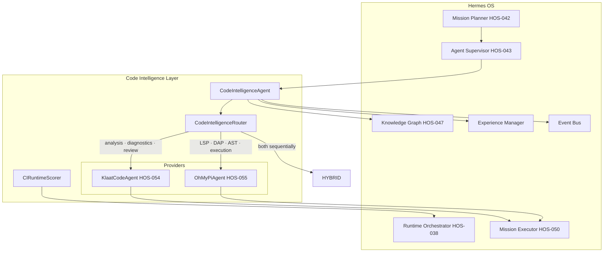

# Code Intelligence Architecture

## HOS-055D

---

## 1. Overview

The Code Intelligence layer is a **meta-agent** that intelligently routes code tasks between **KlaatCode** and **Oh My Pi**. It acts as a single entry point for all code-related operations, automatically selecting the best provider based on task characteristics, historical performance, and resource constraints.

### Why a Meta-Agent?

| Without CI Layer | With CI Layer |
|---|---|
| Manually choose KlaatCode vs Oh My Pi | Automatic selection based on task analysis |
| No cross-provider optimization | Hybrid execution (KC analyze → OMP execute) |
| Inconsistent quality | Adaptive scoring from historical data |
| No provider fallback | Automatic fallback to available provider |

---

## 2. Architecture



---

## 3. Component Details

### 3.1 CodeIntelligenceRouter

The scoring engine that decides which provider to use.

**Scoring Factors (weighted)**:

| Factor | Weight | Description |
|---|---|---|
| `task_fit` | 30% | How well the provider matches the task type |
| `lsp_dap_ast` | 20% | Whether the provider has required LSP/DAP/AST capabilities |
| `historical_success` | 25% | Adaptive: success rate from past executions |
| `cost_efficiency` | 15% | Estimated resource cost |
| `language_match` | 10% | Language proficiency |

**Task-to-Provider Mapping**:

| Task Type | Primary | Secondary | Mode |
|---|---|---|---|
| Code Analysis | KlaatCode | OhMyPi | Single best |
| Refactoring | OhMyPi | KlaatCode | Single best |
| Debugging | OhMyPi | — | OhMyPi only |
| Architecture Review | KlaatCode | — | KlaatCode only |
| Code Generation | OhMyPi | KlaatCode | Single best |
| Test Generation | KlaatCode | OhMyPi | Single best |
| Optimization | KlaatCode | OhMyPi | Hybrid if close |
| Diagnostics | KlaatCode | OhMyPi | Hybrid |
| Code Review | KlaatCode | OhMyPi | Hybrid always |
| Documentation | KlaatCode | — | KlaatCode only |

### 3.2 CodeIntelligenceAgent

Meta-agent lifecycle:

```
CREATED → STARTING → READY ⇄ BUSY → PAUSED/FAILED/STOPPED
```

Execution pipeline:

```
1. Classify task → CodeIntelligenceTask
2. Router scores both providers → RoutingDecision
3. Execute via selected provider:
   - Single best: one provider
   - Hybrid both: KlaatCode first (analysis), OhMyPi second (LSP/DAP)
4. Record result → Memory + EventBus
5. Update provider-specific metrics
```

**Published Events**:

| Event | Payload |
|---|---|
| `ci.agent.ready` | agent_id |
| `ci.routing.decided` | decision dict, task_type |
| `ci.task.started` | task_type, provider, strategy |
| `ci.task.completed` | task_type, provider, strategy, duration_ms |
| `ci.task.failed` | task_type, provider, errors |
| `ci.hybrid.executed` | success, errors, duration_ms |
| `ci.memory.recorded` | task_id, provider |

### 3.3 CIRuntimeScorer

Runtime adapter that scores both providers as runtime candidates for the Runtime Orchestrator.

**Factors**:
- Task type fit (35%)
- Historical success (25%)
- Resource cost (20%)
- Average duration (10%)
- Complexity modifier (10%)

**Context modifiers**: `requires_lsp`/`requires_dap` boosts OhMyPi by 20%, reduces KlaatCode by 20%.

---

## 4. Data Flow Examples

### 4.1 Code Analysis → KlaatCode

```
User: "Analyze the authentication module"
  → Mission Planner: creates CODE_ANALYSIS mission
  → Agent Supervisor: dispatches to CodeIntelligenceAgent
  → Router: scores KC=0.92, OMP=0.65
  → Decision: KlaatCode (single_best, reason: project_analysis)
  → KlaatCodeAgent.analyze_project("auth")
  → EventBus: ci.routing.decided, ci.task.completed
  → Memory: Episodic record with provider=klaatcode
```

### 4.2 Debugging → Oh My Pi

```
User: "Debug the login endpoint timeout"
  → Mission Planner: creates DEBUGGING mission
  → Agent Supervisor: dispatches to CodeIntelligenceAgent
  → Router: scores KC=0.22, OMP=0.96 (DAP required)
  → Decision: OhMyPi (single_best, reason: dap_required)
  → OhMyPiAgent.debug_start("auth/login.py")
  → EventBus: ci.routing.decided, ci.task.completed
  → Memory: Episodic record with provider=ohmypi
```

### 4.3 Code Review → Hybrid

```
User: "Review the PR for security issues"
  → Mission Planner: creates CODE_REVIEW mission
  → Agent Supervisor: dispatches to CodeIntelligenceAgent
  → Router: scores KC=0.88, OMP=0.60 (hybrid always for review)
  → Decision: Hybrid (hybrid_both)
  → Phase 1: KlaatCode analyzes project structure + dependencies
  → Phase 2: OhMyPi runs LSP diagnostics on changed files
  → Merged result: KC analysis + OMP LSP feedback
  → EventBus: ci.hybrid.executed, ci.task.completed
  → Memory: Episodic record with strategy=hybrid
```

---

## 5. Hermes ↔ Providers Responsibility Matrix

| Capability | Hermes | KlaatCode | Oh My Pi | CI Layer |
|---|---|---|---|---|
| Task Classification | ✅ | — | — | ✅ Routes |
| Provider Selection | — | — | — | ✅ Scores |
| Project Analysis | — | ✅ analyze_project | — | Routes to KC |
| LSP Intelligence | — | — | ✅ LSP | Routes to OMP |
| DAP Debugging | — | — | ✅ DAP | Routes to OMP |
| AST Manipulation | — | — | ✅ tree-sitter | Routes to OMP |
| Code Execution | — | — | ✅ Python/JS | Routes to OMP |
| Diagnostics | — | ✅ run_diagnostics | ✅ LSP diags | Hybrid |
| Memory | ✅ Unified Memory | — | — | Records with provider attr |
| Governance | ✅ Policy Engine | — | — | Hermes only |
| Planning | ✅ Mission DAG | — | — | Hermes only |

---

## 6. File Manifest

```
backend/
├── integrations/code_intelligence/
│   ├── __init__.py
│   ├── code_intelligence_models.py    # Task types, providers, scoring models
│   └── code_intelligence_router.py    # Scoring engine + routing decisions
│
├── agents/specialized/code_intelligence/
│   ├── __init__.py
│   ├── code_intelligence_agent.py     # Meta-agent (lifecycle, task exec, memory, events)
│   ├── capabilities.py                # Enums, task→capability mappings, CI_EVENTS
│   └── profile.py                     # Static profile (7 capabilities, 2 providers)
│
├── runtime/code_intelligence/
│   ├── __init__.py
│   └── ci_scorer.py                   # Runtime scoring for both providers
│
frontend/src/
├── components/sidebar.tsx             # + "Code Intel" navigation entry
└── features/code-intelligence/
    └── code-intelligence-center.tsx    # Cockpit with task routing map + provider stats
│
tests/architecture/
└── test_code_intelligence.py          # 45 tests (9 classes)

docs/architecture/
└── CODE_INTELLIGENCE_ARCHITECTURE.md   # This document
```

---

## 7. Test Coverage

| Test Class | Count | Area |
|---|---|---|
| TestRouterSelection | 10 | Provider selection, force, fallback, scoring |
| TestRouterHistory | 4 | Historical record, adaptive scoring |
| TestCIAgentLifecycle | 8 | States, start/stop/pause, capabilities, events |
| TestCIAgentTaskExecution | 7 | KC tasks, OMP tasks, hybrid, force, metrics, history |
| TestCIAgentEvents | 3 | Routing, completion, hybrid events |
| TestCIRuntimeScoring | 8 | Scores, availability, LSP context, recommendations |
| TestCIModels | 5 | Serialization, provider scores, profiles |
| TestCIThreadSafety | 3 | Concurrent routing, agent execution, scoring |
| TestFactory | 3 | create_code_intelligence_agent with/without providers |
| **Total** | **51** | — |
