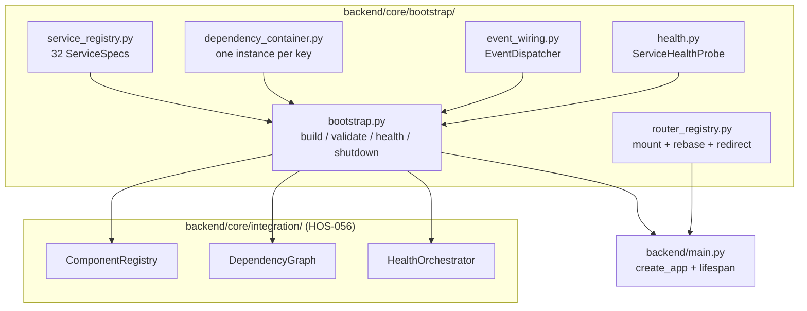
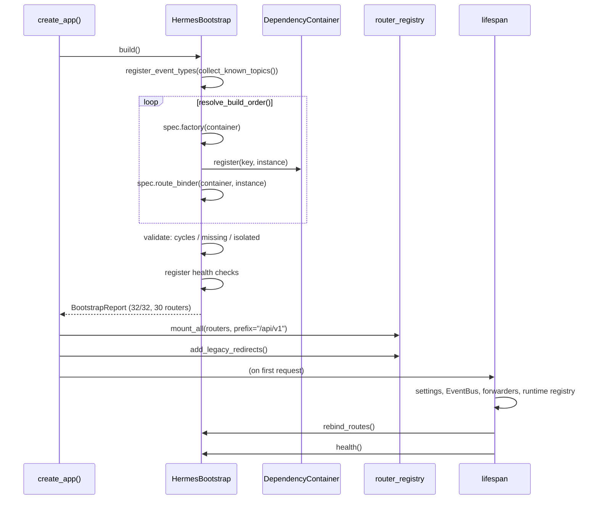

# Composition Root Architecture

## HOS-066B

> The layer that turns 32 validated subsystems into one running operating system.

---

## 1. The problem it solves

Before HOS-066B, Hermes OS was feature-complete and did not work.

Every subsystem was implemented, unit-tested and documented. Every one of them
also carried an injection seam, deliberately placed:

| Seam | Where | Purpose |
|---|---|---|
| `on_event: Callable \| None = None` | 16 subsystem constructors | publish events outward |
| `create_*_routes(service) -> APIRouter` | 14 route modules | bind HTTP to a live service |
| `configure(get_score=…, get_health=…)` | `RuntimeOrchestrator`, `SimulationEngine` | supply live scoring |
| `IntegrationManager` | `backend/core/integration/` | register components + health |

**None of them was ever called in production.** The consequences were exactly
what you would predict from that one fact:

- `backend/main.py` hand-listed the routers it mounted, and the list had fallen
  19 routers behind the code, so the entire Hermes OS API answered `404`;
- the 16 endpoints that *were* reachable answered `503 not initialized`, because
  their `create_*_routes` hook had never run;
- `RuntimeOrchestrator` scored runtimes with `lambda rid: None` callbacks and
  degraded silently;
- the `EventHub` allow-list still held its original six topics while the system
  had grown to emit 90, so 26 of 28 RAL topics were dropped with a log line;
- seven subsystems (autonomous, conversation, evolution, model_intelligence,
  voice, logging, storage) had no dependency edge in either direction — they were
  islands;
- nine subsystems exposed `handle_*(...)` functions and no `APIRouter` at all,
  so seven Cockpit Centers had no backend to talk to.

The suite stayed green throughout, because every test built its own
`FastAPI()` and mounted the router it wanted to test. Nothing exercised the real
app object.

---

## 2. Shape



The catalogue is the single source of truth. Build order, the dependency graph,
the health surface and the router mounting are all *derived* from
`SERVICE_SPECS` — three hand-kept lists would drift the way the `EventHub`
allow-list did.

---

## 3. `ServiceSpec`

```python
ServiceSpec(
    key="security_engine",
    name="Security & Trust",
    category=ComponentCategory.POLICY,
    factory=_make_security_engine,          # calls the existing constructor
    dependencies=("event_dispatcher",),     # by key, never by type
    route_binder=_bind_security_routes,     # calls the existing hook
    produced_events=("security.threat.detected", ...),
    capabilities=("permissions", "trust", "threat_detection"),
)
```

Dependencies are declared **by key, not inferred from type annotations**. That
keeps the graph explicit and lets `DependencyGraph` validate it *before*
anything is constructed.

### Factories build nothing new

Each factory calls a constructor that already existed. Where a module already
assembled a working object graph at import time, the factory **adopts** it
rather than building a rival:

| Subsystem | Adopted from | Why |
|---|---|---|
| `skill_distributor` | `skills/routes.py::_distributor` | that module already wires registry + selector + resolver + loader + cache + profiler |
| `tool_platform` | `tools/routes.py::_registry` | already wired to policy, sandbox, executor, health, memory, MCP |
| `execution_controller` | `execution/routes.py::_controller` | already wraps `MissionExecutor` |
| `model_intelligence` | `model_intelligence/routes.py::_get_router()` | already wires profiler + analyzer + predictor |
| `klaatcode`, `ohmypi` | their `routes.py::_adapter` | already wired to client + policy + sandbox |

Building a second set would give the HTTP layer and the container two different
registries — the exact duplication the container exists to prevent. Adopted
specs are flagged `adopts_module_singleton=True` and surfaced in the dependency
report.

---

## 4. Sequence



### Startup

1. configuration (`get_settings()`, fail fast)
2. `EventBusImpl` + wildcard forwarder → `EventHub`
3. legacy `MessageBus` → `agent.message` proxy
4. runtime registry and factory (HOS-008)
5. `rebind_routes()` — see §7
6. subsystem health verification
7. MCP streamable-HTTP session manager

### Shutdown

Reverse of the build order, every step independent:

1. subsystems (`bootstrap.shutdown()` — flush, save, stop schedulers)
2. runtime registry, then the legacy runtime holder
3. legacy proxy unsubscribe
4. wildcard forwarder unsubscribe
5. `EventBus` last, because everything above may still publish

`shutdown()` probes for `shutdown` / `stop` / `close` / `flush` / `save` /
`persist` and calls **one** of them per subsystem — several subsystems alias
`stop` and `close`, and calling both would double-release.

---

## 5. Event wiring

Every subsystem receives the same `EventDispatcher`, relabelled per subsystem
via `.scoped(name)` (shared sinks and counters — a relabel, not a second
dispatcher). It fans each publish out to:

- the **`SystemEventBus`** — durable, queryable history;
- the **`EventHub`** — WebSocket fan-out to the Cockpit.

It accepts both call shapes found in the codebase — `on_event(type, payload)`
and `on_event(type, payload, severity=...)` — and **never raises**: a dashboard
notification must not be able to fail the work that produced it.

### Topic allow-list

`EventHub` still validates topics, because that check catches a producer
inventing a name and a client filtering on a typo. What changed is the list:

- `backend/core/event_topics.py` holds a baseline of 143 topics, grouped by
  owning layer. The `SUBSYSTEM_TOPICS` group is **collected from the code** — an
  AST walk over every string constant passed to an `on_event`/`_publish`/`_emit`
  call — because an earlier hand-written version named topics no emitter used
  while missing 67 that emitters did.
- `EVENT_TYPES` is a mutable `set`, not a `frozenset`, so `register_event_types()`
  is visible through `from … import EVENT_TYPES` references (notably
  `backend/api/routes/ws.py`).
- the bootstrap re-derives topics from the live enums at startup, so the enum
  stays authoritative.

### Cross-thread dispatch

Subsystems publish from threadpool workers and background schedulers. The old
code did:

```python
loop = asyncio.get_event_loop()        # raises off the main thread
if loop.is_running():
    asyncio.ensure_future(send(event)) # not thread-safe
```

Both calls are wrong off the main thread, and the `RuntimeError` was swallowed —
so the Cockpit stream looked connected and stayed empty. The loop is now captured
when a WebSocket client connects and events are scheduled with
`run_coroutine_threadsafe`, with a `get_running_loop()` fast path for publishes
that are already on the serving loop.

---

## 6. Namespace

`/api/v1` is the one canonical prefix.

- The SDS router's `/api/hermes-os` prefix is baked into its construction, so
  `rebase_router()` re-registers **the same endpoint functions** under `/api/v1`.
  One implementation, two mount points — not a copy.
- `/api/hermes-os/*` returns `307` to `/api/v1/*`. A 307 and not a 302 so the
  method and body survive, which matters because several redirected endpoints
  are POSTs.
- `mount_all()` detects duplicate `(method, path)` pairs and logs them loudly.
  FastAPI resolves duplicates by first-registered-wins and says nothing — that is
  how a Pydantic-validated mission-creation endpoint ended up shadowed by an
  unvalidated one.

The legacy Hermes API (`/chat`, `/memory`, `/tasks`, …) deliberately keeps its
unprefixed paths: the existing frontend and the MCP tools call them there.

---

## 7. Route binding is global — and why `rebind_routes()` exists

`create_*_routes(service)` binds by assigning a **module-level global**. That
means route modules are owned by whichever bootstrap ran last.

In production this is a non-issue: one process builds one app. In a test
interpreter it very much is one — `backend.main` builds an app at import, and
every test that calls `create_app()` builds another. Without intervention the
*last* bootstrap constructed would own the route modules while an *earlier*
app served the requests.

So the lifespan calls `bootstrap.rebind_routes()`, which re-runs every route
binder. The app that is actually running owns the bindings. The operation is
idempotent — binders only assign and return the router.

---

## 8. Health, readiness, statistics

STEP 9 asked for `health()`, `ready()` and `statistics()` on every subsystem.
Adding three methods to 32 classes would be the subsystem rewrite the brief
forbids, so `ServiceHealthProbe` provides the uniformity by **adapting what each
subsystem already exposes** — `statistics`, `get_statistics`, `get_stats`,
`stats`, `get_status`, `status`, `get_summary`, first match wins.

Two details that matter:

- the probe checks the accessor's **signature** and skips anything with a
  required parameter. `LearningEngine.get_stats(runtime_id)` shares a name with
  the zero-arg convention; calling it blind raised `TypeError` and scored a
  perfectly healthy subsystem as unhealthy. A health check must never invent
  arguments.
- a subsystem with no accessor is reported **`silent`**, not healthy and not
  degraded. It is an absence of telemetry, not a fault, and pretending otherwise
  in either direction would be misleading. 11 of 32 are currently silent.

Exposed at:

| Endpoint | Content |
|---|---|
| `GET /health` | liveness |
| `GET /api/v1/system/health` | per-subsystem status |
| `GET /api/v1/system/ready` | assembly completeness + blockers |
| `GET /api/v1/system/statistics` | per-subsystem telemetry + event counters |
| `GET /api/v1/system/assembly` | build report + router report |
| `GET /api/v1/system/dependencies` | full dependency graph |

---

## 9. Validation

`BootstrapReport` records failures instead of raising on the first one: a single
unavailable integration (Alexandrie offline, `kt_kernel` absent) must not stop
the other 31 subsystems from serving. `is_complete()` then makes STEP 10's
"GO only at 100%" a property that can be *asked*:

```python
report.is_complete()        # no failures, no cycles, no missing deps, all built
report.completion_percent() # 100.0
```

Current state:

| Check | Result |
|---|---|
| Subsystems built | **32 / 32 (100%)** |
| Routers bound | **30** |
| Build failures | 0 |
| Router failures | 0 |
| Route collisions | 0 |
| Dependency cycles | 0 |
| Missing dependencies | 0 |
| Isolated subsystems | 0 |
| Orphan `APIRouter`s | 0 |
| Health | healthy (21 reporting, 11 silent) |

See [`DEPENDENCY_REPORT.md`](DEPENDENCY_REPORT.md) for the generated graph.

---

## 10. Adding a subsystem

1. Add a `ServiceSpec` to `SERVICE_SPECS` with a factory calling your
   constructor, and its dependencies by key.
2. If it has HTTP endpoints, give the route module a
   `create_x_routes(service) -> APIRouter` hook and point `route_binder` at it.
3. Declare `produced_events` / `consumed_events`. If a topic is new, add it to
   `SUBSYSTEM_TOPICS` in `backend/core/event_topics.py` or the `EventHub` will
   reject it.

Nothing in `backend/main.py` needs to change. `tests/integration/test_assembly.py`
will assert the new subsystem builds, binds, is registered, is non-isolated, and
serves without a 5xx.
