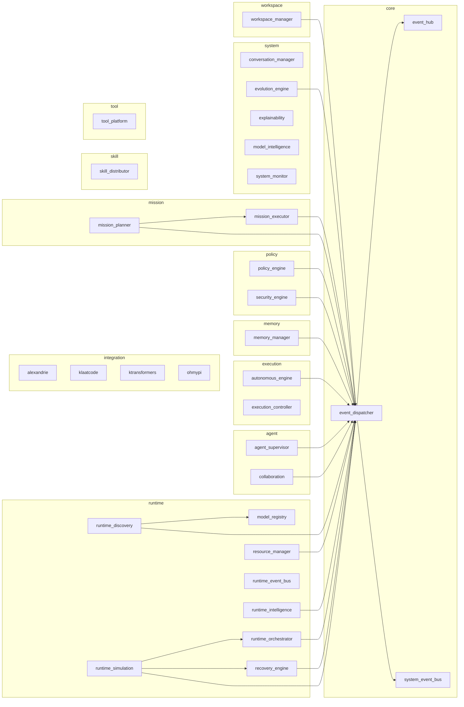

# Hermes OS — Dependency Report

> Generated from the live composition root on 2026-07-30.
> Regenerate with `GET /api/v1/system/dependencies` or
> `python -c "from backend.core.bootstrap import HermesBootstrap; b=HermesBootstrap(); b.build(); print(b.dependency_report())"`.

This file is the STEP 8 deliverable of HOS-066B. It describes the system that
actually starts, not an intended design: every row below is a subsystem the
container built and registered at runtime.

---

## Summary

| Metric | Value |
|---|---|
| Subsystems declared | 32 |
| Subsystems built | 32 |
| Completion | 100.0% |
| Routers bound | 30 |
| Build failures | 0 |
| Router failures | 0 |
| Dependency cycles | 0 |
| Missing dependencies | 0 |
| Isolated subsystems | 0 |
| Health | healthy |
| Build time | 848 ms |

### Graph

| Metric | Value |
|---|---|
| total components | 32 |
| total edges | 22 |
| cycle count | 0 |
| has cycles | False |

---

## Build order

Topologically sorted: a subsystem never appears before something it depends on.

1. `event_hub`
2. `system_event_bus`
3. `event_dispatcher`
4. `resource_manager`
5. `runtime_orchestrator`
6. `model_registry`
7. `runtime_discovery`
8. `recovery_engine`
9. `runtime_intelligence`
10. `runtime_simulation`
11. `runtime_event_bus`
12. `ktransformers`
13. `mission_executor`
14. `mission_planner`
15. `agent_supervisor`
16. `collaboration`
17. `memory_manager`
18. `skill_distributor`
19. `tool_platform`
20. `policy_engine`
21. `workspace_manager`
22. `security_engine`
23. `execution_controller`
24. `autonomous_engine`
25. `evolution_engine`
26. `conversation_manager`
27. `explainability`
28. `model_intelligence`
29. `alexandrie`
30. `klaatcode`
31. `ohmypi`
32. `system_monitor`

---

## Subsystems

| Subsystem | Category | Depends on | Depended on by | Publishes | Capabilities |
|---|---|---|---|---|---|
| **agent_supervisor** | agent | `event_dispatcher` | — | 3 | agent_lifecycle, dispatch |
| **collaboration** | agent | `event_dispatcher` | — | 3 | delegation, consensus, review |
| **event_dispatcher** | core | `event_hub`, `system_event_bus` | `agent_supervisor`, `autonomous_engine`, `collaboration`, `evolution_engine`, `memory_manager`, `mission_executor`, `mission_planner`, `policy_engine`, `recovery_engine`, `resource_manager`, `runtime_discovery`, `runtime_intelligence`, `runtime_orchestrator`, `runtime_simulation`, `security_engine`, `workspace_manager` | — | event_dispatch |
| **event_hub** | core | — | `event_dispatcher` | — | event_fanout, websocket |
| **system_event_bus** | core | — | `event_dispatcher` | — | pubsub, event_history |
| **autonomous_engine** | execution | `event_dispatcher` | — | 2 | goal_execution, autonomy |
| **execution_controller** | execution | — | — | 3 | execution, checkpointing |
| **alexandrie** | integration | — | — | 2 | document_sync, knowledge_import |
| **klaatcode** | integration | — | — | 1 | code_analysis, code_execution |
| **ktransformers** | integration | — | — | 2 | inference, moe_offload |
| **ohmypi** | integration | — | — | 1 | shell, automation |
| **memory_manager** | memory | `event_dispatcher` | — | 3 | hybrid_search, knowledge_graph, embeddings |
| **mission_executor** | mission | `event_dispatcher` | `mission_planner` | 3 | mission_graph, dag_execution |
| **mission_planner** | mission | `mission_executor`, `event_dispatcher` | — | 1 | planning, decomposition |
| **policy_engine** | policy | `event_dispatcher` | — | 3 | policy, approval, audit |
| **security_engine** | policy | `event_dispatcher` | — | 3 | permissions, trust, threat_detection |
| **model_registry** | runtime | — | `runtime_discovery` | — | model_catalogue |
| **recovery_engine** | runtime | `event_dispatcher` | `runtime_simulation` | 2 | recovery, circuit_breaker |
| **resource_manager** | runtime | `event_dispatcher` | — | 3 | vram_allocation, ram_allocation |
| **runtime_discovery** | runtime | `model_registry`, `event_dispatcher` | — | 2 | discovery, benchmark |
| **runtime_event_bus** | runtime | — | — | 4 | runtime_events, websocket |
| **runtime_intelligence** | runtime | `event_dispatcher` | — | — | scoring, recommendation |
| **runtime_orchestrator** | runtime | `event_dispatcher` | `runtime_simulation` | 1 | runtime_selection |
| **runtime_simulation** | runtime | `runtime_orchestrator`, `recovery_engine`, `event_dispatcher` | — | 1 | simulation |
| **skill_distributor** | skill | — | — | 3 | skill_selection, skill_distribution |
| **conversation_manager** | system | — | — | 2 | conversation, intent_analysis |
| **evolution_engine** | system | `event_dispatcher` | — | 3 | self_improvement, proposal_simulation |
| **explainability** | system | — | — | 1 | explanation |
| **model_intelligence** | system | — | — | 2 | model_profiling, adaptive_routing |
| **system_monitor** | system | — | — | 1 | metrics, monitoring |
| **tool_platform** | tool | — | — | 2 | tool_execution, mcp_client, sandbox |
| **workspace_manager** | workspace | `event_dispatcher` | — | 3 | workspace, isolation, artifacts |

---

## Event topics by subsystem

### `agent_supervisor`

Publishes:

- `agent.registered`
- `agent.state_changed`
- `agent.failed`

### `collaboration`

Publishes:

- `delegation.requested`
- `consensus.reached`
- `conflict.resolved`

### `autonomous_engine`

Publishes:

- `goal.started`
- `goal.completed`

### `execution_controller`

Publishes:

- `execution.started`
- `execution.completed`
- `checkpoint.saved`

### `alexandrie`

Publishes:

- `alexandrie.synced`
- `alexandrie.circuit.opened`

### `klaatcode`

Publishes:

- `klaatcode.executed`

### `ktransformers`

Publishes:

- `ktransformers.model.loaded`
- `ktransformers.inference.completed`

### `ohmypi`

Publishes:

- `ohmypi.executed`

### `memory_manager`

Publishes:

- `memory.stored`
- `memory.indexed`
- `experience.recorded`

### `mission_executor`

Publishes:

- `mission.started`
- `mission.completed`
- `mission.failed`

### `mission_planner`

Publishes:

- `mission.created`

### `policy_engine`

Publishes:

- `approval.requested`
- `approval.granted`
- `audit.created`

### `security_engine`

Publishes:

- `security.permission.denied`
- `security.threat.detected`
- `security.agent.trust.updated`

### `recovery_engine`

Publishes:

- `recovery.started`
- `recovery.completed`

### `resource_manager`

Publishes:

- `resource.allocated`
- `resource.released`
- `resource.threshold`

### `runtime_discovery`

Publishes:

- `discovery.completed`
- `benchmark.completed`

### `runtime_event_bus`

Publishes:

- `runtime.started`
- `runtime.failed`
- `runtime.health_changed`
- `routing.decision`

Subscribes:

- `runtime.stopped`
- `runtime.recovered`

### `runtime_orchestrator`

Publishes:

- `orchestrator.decision`

### `runtime_simulation`

Publishes:

- `simulation.completed`

### `skill_distributor`

Publishes:

- `skill.loaded`
- `skill.selected`
- `skill.distributed`

### `conversation_manager`

Publishes:

- `conversation.started`
- `conversation.message`

### `evolution_engine`

Publishes:

- `proposal.created`
- `proposal.applied`
- `evolution.completed`

### `explainability`

Publishes:

- `decision.explained`

### `model_intelligence`

Publishes:

- `model.profiled`
- `model.recommended`

### `system_monitor`

Publishes:

- `system.metrics`

### `tool_platform`

Publishes:

- `tool.executed`
- `mcp.connected`

### `workspace_manager`

Publishes:

- `workspace.created`
- `workspace.locked`
- `artifact.created`

---

## Validation

- **No dependency cycles.**

- **No missing dependencies.**

- **No isolated subsystems.** Every subsystem has at least one
  dependency edge or one declared event topic. The RC1 audit found seven
  with neither (autonomous, conversation, evolution, model_intelligence,
  voice, logging, storage).

---

## Mermaid

