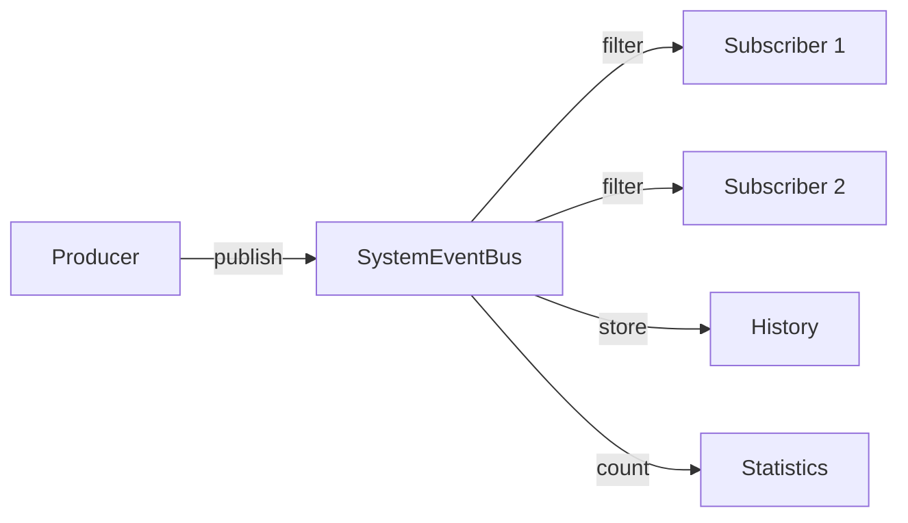

# Hermes OS Event Catalog

## HOS-056 — Global Integration Audit

---

## 1. Event Architecture Overview

Hermes OS uses a unified event bus (`SystemEventBus`) with typed events organized by subsystem. All events follow the naming convention:

```
<subsystem>.<component>.<action>
```

Event types are organized into families (e.g., `runtime.*`, `agent.*`, `mission.*`) via the `SystemEventType` enum.

### Event Flow



---

## 2. Full Event Catalog

### 2.1 Runtime Events (`runtime.*`)

| Event | Producer | Consumers | Payload | Criticality |
|---|---|---|---|---|
| `runtime.started` | Runtime Manager | Orchestrator, EventBus | runtime_id, type, version | INFO |
| `runtime.stopped` | Runtime Manager | Orchestrator, Resource Manager | runtime_id, reason | INFO |
| `runtime.health.changed` | Runtime Manager | Orchestrator, Cockpit | runtime_id, status, metrics | WARNING |
| `runtime.resource.allocated` | Resource Manager | Orchestrator, Execution | resource_id, amount, runtime_id | INFO |
| `runtime.resource.released` | Resource Manager | Orchestrator | resource_id, amount | INFO |
| `runtime.resource.critical` | Resource Manager | All | resource_type, usage_percent | CRITICAL |
| `runtime.orchestrator.selected` | Runtime Orchestrator | Execution, Cockpit | task_id, runtime, score | INFO |
| `runtime.orchestrator.fallback` | Runtime Orchestrator | Policy, Cockpit | task_id, reason | WARNING |
| `runtime.simulation.completed` | Simulation Engine | Mission Planner, Memory | simulation_id, duration, result | INFO |
| `runtime.discovery.found` | Discovery Engine | Orchestrator, Registry | runtime_type, endpoint, capabilities | INFO |
| `runtime.benchmark.completed` | Benchmark Engine | Orchestrator, Memory | runtime_id, metrics, score | INFO |

### 2.2 Agent Events (`agent.*`)

| Event | Producer | Consumers | Payload | Criticality |
|---|---|---|---|---|
| `agent.supervisor.registered` | Agent Supervisor | Registry, Cockpit | agent_id, agent_type, capabilities | INFO |
| `agent.supervisor.started` | Agent Supervisor | Cockpit, Memory | agent_id, timestamp | INFO |
| `agent.supervisor.stopped` | Agent Supervisor | Cockpit | agent_id, reason | INFO |
| `agent.supervisor.failed` | Agent Supervisor | Cockpit, Policy | agent_id, error | ERROR |
| `agent.supervisor.dispatch` | Agent Supervisor | Execution, Cockpit | agent_id, task_id, mission_id | INFO |
| `agent.collaboration.message` | Collaboration | All Agents, Cockpit | from, to, type, content | INFO |
| `agent.collaboration.delegated` | Collaboration | Execution, Cockpit | from, to, task_id | INFO |
| `agent.collaboration.reviewed` | Collaboration | Execution, Cockpit | task_id, verdict | INFO |

### 2.3 Mission Events (`mission.*`)

| Event | Producer | Consumers | Payload | Criticality |
|---|---|---|---|---|
| `mission.created` | Mission Planner | Execution, Cockpit, Memory | mission_id, title, type | INFO |
| `mission.planned` | Mission Planner | Execution, Cockpit | mission_id, nodes, edges | INFO |
| `mission.started` | Execution | Cockpit, Memory, EventBus | mission_id, timestamp | INFO |
| `mission.progress` | Execution | Cockpit | mission_id, progress, node_id | INFO |
| `mission.completed` | Execution | Memory, Cockpit, Intelligence | mission_id, duration, result | INFO |
| `mission.failed` | Execution | Policy, Cockpit, Memory | mission_id, error, node_id | ERROR |
| `mission.paused` | Execution | Cockpit | mission_id, reason | INFO |
| `mission.cancelled` | Execution | Cockpit, Resources | mission_id, reason | WARNING |
| `mission.validation.passed` | Validation Engine | Execution, Cockpit | task_id, outcome | INFO |
| `mission.validation.failed` | Validation Engine | Execution, Policy | task_id, errors | ERROR |

### 2.4 Execution Events (`execution.*`)

| Event | Producer | Consumers | Payload | Criticality |
|---|---|---|---|---|
| `execution.started` | Execution Engine | Cockpit, EventBus | execution_id, mission_id | INFO |
| `execution.planning` | Execution Engine | Cockpit | execution_id | INFO |
| `execution.task_started` | Execution Engine | Cockpit, Memory | task_id, agent_id | INFO |
| `execution.task_completed` | Execution Engine | Cockpit, Memory | task_id, outcome, duration_ms | INFO |
| `execution.failed` | Execution Engine | Cockpit, Policy | task_id, reason | ERROR |
| `execution.waiting_approval` | Execution Engine | Policy, Cockpit | task_id, requires | WARNING |
| `execution.completed` | Execution Engine | Memory, Cockpit | execution_id, report | INFO |
| `execution.optimized` | Optimization Engine | Cockpit, Intelligence | execution_id, recommendations | INFO |

### 2.5 Memory Events (`memory.*`)

| Event | Producer | Consumers | Payload | Criticality |
|---|---|---|---|---|
| `memory.stored` | Memory Manager | Cockpit | memory_type, entry_id, tags | INFO |
| `memory.retrieved` | Memory Manager | Agent, Cockpit | memory_type, count, query | INFO |
| `memory.pruned` | Memory Manager | Cockpit | entries_removed, reason | INFO |
| `memory.kg.updated` | Knowledge Graph | Cockpit, Agent | node_count, edge_count | INFO |
| `memory.experience.recorded` | Experience Manager | Intelligence, Cockpit | pattern, success, confidence | INFO |

### 2.6 Skill Events (`skill.*`)

| Event | Producer | Consumers | Payload | Criticality |
|---|---|---|---|---|
| `skill.registered` | Skill Manager | Registry, Cockpit | skill_id, name, domain | INFO |
| `skill.loaded` | Skill Manager | Agent, Cockpit | skill_id, agent_id | INFO |
| `skill.unloaded` | Skill Manager | Cockpit | skill_id, agent_id | INFO |
| `skill.selected` | Skill Distribution | Agent, Cockpit | skill_id, score, task | INFO |

### 2.7 Tool Events (`tool.*`, `mcp.*`)

| Event | Producer | Consumers | Payload | Criticality |
|---|---|---|---|---|
| `tool.registered` | Tool Registry | Cockpit | tool_id, name, type | INFO |
| `tool.executed` | Tool Platform | Execution, Cockpit | tool_id, status, duration_ms | INFO |
| `tool.failed` | Tool Platform | Policy, Cockpit | tool_id, error | ERROR |
| `mcp.server.connected` | MCP Manager | Cockpit | server_name, transport | INFO |
| `mcp.server.disconnected` | MCP Manager | Cockpit, Tool Registry | server_name, reason | WARNING |
| `mcp.tool.called` | MCP Manager | Cockpit | server, tool, duration_ms | INFO |

### 2.8 Policy Events (`policy.*`, `approval.*`)

| Event | Producer | Consumers | Payload | Criticality |
|---|---|---|---|---|
| `policy.evaluated` | Policy Engine | Execution, Cockpit | operation, verdict, rule_id | INFO |
| `policy.denied` | Policy Engine | Cockpit, Agent | operation, reason, agent_id | WARNING |
| `approval.requested` | Policy Engine | Cockpit, User | approval_id, operation, priority | WARNING |
| `approval.resolved` | Policy Engine | Cockpit, Execution | approval_id, outcome, reviewer | INFO |

### 2.9 Workspace Events (`workspace.*`)

| Event | Producer | Consumers | Payload | Criticality |
|---|---|---|---|---|
| `workspace.created` | Workspace Manager | Cockpit | workspace_id, path | INFO |
| `workspace.edit.prepared` | Workspace Manager | Execution, Cockpit | file, agent_id, branch | INFO |
| `workspace.edit.committed` | Workspace Manager | Cockpit, Validation | file, agent_id, commit_hash | INFO |
| `workspace.edit.rolled_back` | Workspace Manager | Cockpit | file, agent_id, reason | INFO |

### 2.10 Integration Events (`ktransformers.*`, `alexandrie.*`, `klaatcode.*`, `ohmypi.*`, `ci.*`)

| Event | Producer | Consumers | Payload | Criticality |
|---|---|---|---|---|
| `ktransformers.loaded` | KTransformers | Orchestrator, Cockpit | model_id, backend, vram_mb | INFO |
| `ktransformers.optimized` | KTransformers | Orchestrator | model_id, optimizations | INFO |
| `ktransformers.failed` | KTransformers | Cockpit, Policy | model_id, error | ERROR |
| `alexandrie.document.created` | Alexandrie | Memory, Cockpit | doc_id, title, version | INFO |
| `alexandrie.document.updated` | Alexandrie | Memory, Cockpit | doc_id, version | INFO |
| `alexandrie.sync.completed` | Alexandrie | Cockpit | synced, failed | INFO |
| `klaatcode.agent.ready` | KlaatCode | Supervisor, Cockpit | agent_id | INFO |
| `klaatcode.task.completed` | KlaatCode | Cockpit, Memory | task_type, duration_ms | INFO |
| `klaatcode.task.failed` | KlaatCode | Cockpit, Policy | task_type, error | ERROR |
| `ohmypi.agent.ready` | OhMyPi | Supervisor, Cockpit | agent_id | INFO |
| `ohmypi.edit.completed` | OhMyPi | Cockpit, Memory | file, duration_ms | INFO |
| `ohmypi.debug.completed` | OhMyPi | Cockpit, Memory | session_id, incidents | INFO |
| `ci.agent.ready` | Code Intelligence | Supervisor, Cockpit | agent_id | INFO |
| `ci.routing.decided` | CI Router | Cockpit, Memory | task_type, provider | INFO |
| `ci.hybrid.executed` | CI Agent | Cockpit, Memory | success, errors | INFO |

### 2.11 System Events (`system.*`, `core.*`)

| Event | Producer | Consumers | Payload | Criticality |
|---|---|---|---|---|
| `system.started` | Core | All | version, timestamp | INFO |
| `system.health.changed` | Health Orchestrator | Cockpit | status, healthy_count, degraded_count | WARNING |
| `system.integration.component_registered` | Integration Manager | Cockpit, Registry | component_id, category | INFO |
| `system.integration.component_unregistered` | Integration Manager | Cockpit | component_id | WARNING |
| `system.warning` | Any | Cockpit | message, severity, source | WARNING |
| `system.error` | Any | Cockpit, Policy | message, source, traceback | ERROR |
| `core.message_bus.ready` | Message Bus | All | bus_id | INFO |

---

## 3. Event Naming Conventions

| Pattern | Example |
|---|---|
| `<subsystem>.<component>.<action>` | `runtime.resource.allocated` |
| `<subsystem>.<component>.started/completed/failed` | `mission.started` / `execution.completed` |
| `<integration>.<action>` | `klaatcode.task.completed` |
| `ci.<action>` | `ci.routing.decided` |

### Rules
1. All lowercase with dots as separators
2. Use past tense for completed actions (`started`, `completed`, `failed`)
3. Use present tense for continuous actions (`running`, `planning`)
4. Integration events use the integration name prefix
5. System-level events use `system.*` or `core.*`

---

## 4. Statistics

| Metric | Count |
|---|---|
| Total unique events | **91** |
| Event families | **11** |
| Producers | **25+** |
| CRITICAL events | **2** |
| ERROR events | **8** |
| WARNING events | **12** |
| INFO events | **69** |


---

## 12. Autonomous Events (HOS-063)

### Producteur : Autonomous Engine (backend/autonomous/)

| Événement | Producteur | Consommateurs | Payload | Criticité |
|---|---|---|---|---|
| `autonomous.goal.received` | AutonomousInterpreter | AutonomousOrchestrator, Memory, Cockpit | goal_id, user_request, timestamp | HIGH |
| `autonomous.goal.analyzed` | AutonomousInterpreter | MissionPlanner, Memory, Cockpit | goal_id, domain, complexity, language | HIGH |
| `autonomous.plan.created` | AutonomousOrchestrator | ExecutionEngine, AgentSupervisor, Cockpit | goal_id, mission_id, dag_nodes, agents | HIGH |
| `autonomous.agent.selected` | DecisionEngine | AgentSupervisor, Cockpit | goal_id, agent_id, confidence, alternatives | MEDIUM |
| `autonomous.execution.started` | AutonomousOrchestrator | ExecutionEngine, EventBus, Cockpit | goal_id, mission_id, start_time | HIGH |
| `autonomous.execution.completed` | AutonomousOrchestrator | Memory, EvolutionEngine, Cockpit | goal_id, mission_id, duration, success | HIGH |
| `autonomous.learning.completed` | AutonomousMemoryLoop | EpisodicMemory, ProceduralMemory, EvolutionEngine | goal_id, lessons, patterns | MEDIUM |
| `autonomous.goal.failed` | AutonomousOrchestrator | RecoveryEngine, Memory, Cockpit | goal_id, error, stage, suggested_fix | CRITICAL |
| `autonomous.goal.paused` | AutonomousEngine | AgentSupervisor, ExecutionEngine, Cockpit | goal_id, paused_by | MEDIUM |
| `autonomous.goal.resumed` | AutonomousEngine | AgentSupervisor, ExecutionEngine, Cockpit | goal_id, resumed_by | MEDIUM |
| `autonomous.goal.cancelled` | AutonomousEngine | AgentSupervisor, ExecutionEngine, Cockpit | goal_id, cancelled_by | MEDIUM |
| `autonomous.decision.made` | DecisionEngine | Memory, Cockpit | goal_id, decision_type, choice, confidence, alternatives | LOW |

### Statistiques

- **Total événements :** 91 + 12 = **103**
- **Familles :** 12 (EventBus, Memory, Runtime, Missions, Agents, Skills, Tools, Workspace, Execution, Sécurité, Intégrations, Autonomous)
