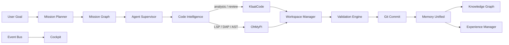
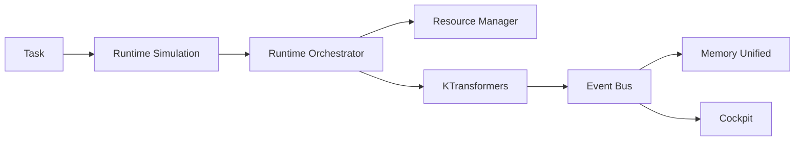
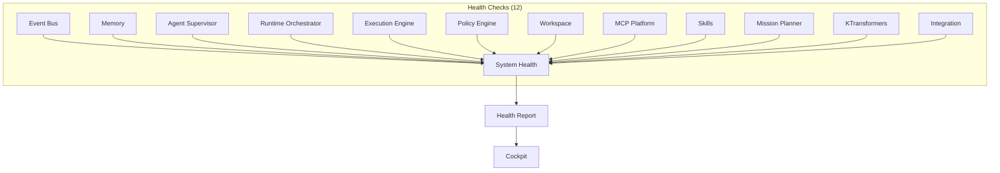
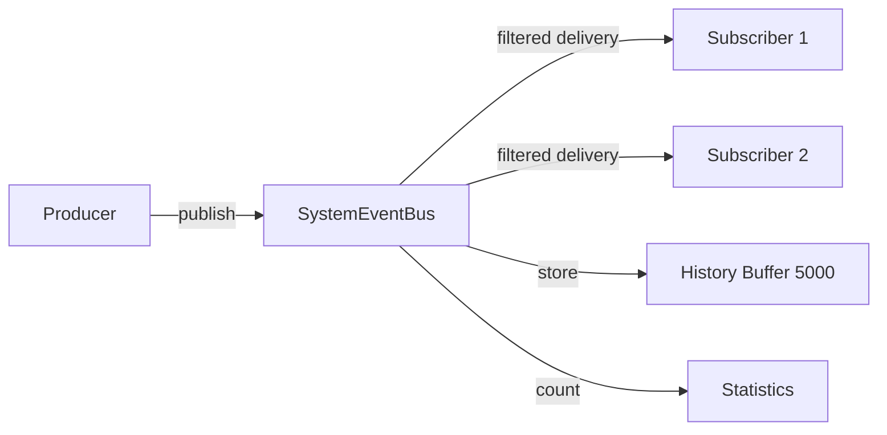
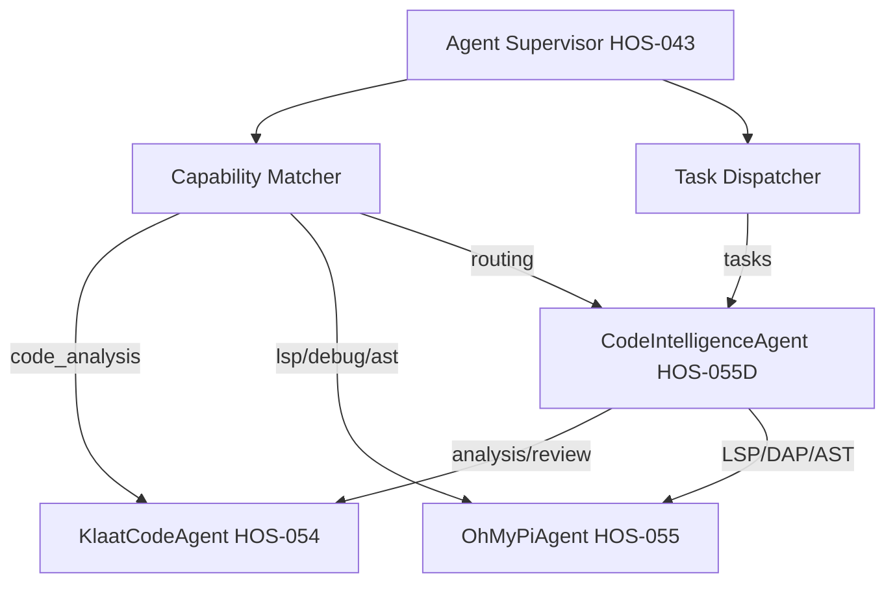
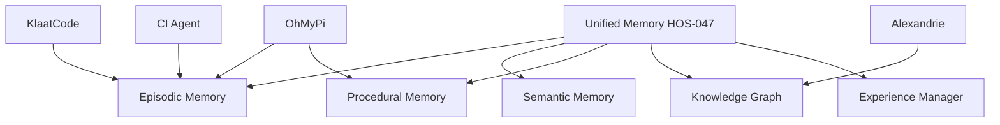

# Hermes OS — Complete System Architecture

## Version 1.0.0 | HOS-056

---

## 1. System Overview

Hermes OS is a **multi-agent orchestration platform** that integrates AI runtime management, mission planning, autonomous execution, memory/knowledge management, and external code intelligence tools into a unified system.

### Architecture Principles

- **Unified Event Bus** — All subsystems communicate through a central publish/subscribe event bus
- **Component Registry** — Every module is registered, discoverable, and health-monitored
- **Pluggable Runtime** — Runtimes (including KTransformers) are discovered and selected adaptively
- **Agent-Centric** — Agents specialize, collaborate, and are orchestrated by the Agent Supervisor
- **Memory-First** — All experiences, knowledge, and documents feed into the Unified Memory stack
- **Policy-Governed** — Every operation passes through the Policy & Approval Engine

---

## 2. Module Registry (25 Components)

### Core (2)
| ID | Name | Dependencies | Capabilities |
|---|---|---|---|
| `core.event_hub` | Core Event Hub | — | Event pub/sub, history |
| `core.integration` | Integration Manager | core.event_hub | Registry, health, dependency graph |

### Runtime (6)
| ID | Name | Dependencies | Capabilities |
|---|---|---|---|
| `runtime.event_bus` | Runtime Event Bus | core.event_hub | Event dispatch, filtered subs |
| `runtime.resource_manager` | Resource Manager | runtime.event_bus | GPU/CPU/RAM allocation |
| `runtime.orchestrator` | Runtime Orchestrator | runtime.event_bus, resource_manager | Runtime selection |
| `runtime.simulation` | Simulation Engine | runtime.event_bus | Execution simulation |
| `runtime.discovery` | Discovery & Benchmark | runtime.event_bus, resource_manager | Runtime discovery |
| `runtime.ktransformers` | KTransformers | orchestrator, resource_manager | Model loading, inference |

### Mission (2)
| ID | Name | Dependencies | Capabilities |
|---|---|---|---|
| `mission.graph` | Mission Graph Engine | core.event_hub | DAG planning |
| `mission.planner` | Mission Planner | mission.graph, simulation | Goal decomposition |

### Agent (5)
| ID | Name | Dependencies | Capabilities |
|---|---|---|---|
| `agent.supervisor` | Agent Supervisor | core.event_hub | Lifecycle, dispatch |
| `agent.collaboration` | Collaboration | agent.supervisor | Messaging, delegation |
| `agent.klaatcode` | KlaatCode Agent | supervisor, mcp_platform | Code analysis, diagnostics |
| `agent.ohmypi` | OhMyPi Agent | supervisor, mcp_platform | LSP, DAP, AST, execution |
| `agent.code_intelligence` | Code Intelligence | klaatcode, ohmypi | Task routing, hybrid exec |

### Memory (1)
| ID | Name | Dependencies | Capabilities |
|---|---|---|---|
| `memory.unified` | Unified Memory & KG | core.event_hub | Episodic, semantic, KG, experience |

### Skills (1)
| ID | Name | Dependencies | Capabilities |
|---|---|---|---|
| `skills.distribution` | Skill Distribution | supervisor, memory | Skill selection, caching |

### Tools (1)
| ID | Name | Dependencies | Capabilities |
|---|---|---|---|
| `tools.mcp_platform` | MCP & Tools Platform | core.event_hub | Tool registry, MCP, sandbox |

### Policy (1)
| ID | Name | Dependencies | Capabilities |
|---|---|---|---|
| `policy.engine` | Policy & Approval Engine | core.event_hub | Evaluation, approval, audit |

### Workspace (1)
| ID | Name | Dependencies | Capabilities |
|---|---|---|---|
| `workspace.manager` | Workspace Manager | policy.engine | Sandbox, git, rollback |

### Execution (1)
| ID | Name | Dependencies | Capabilities |
|---|---|---|---|
| `execution.engine` | Execution Engine | planner, supervisor, skills, tools, orchestrator | Scheduling, coordination, validation |

### Integration (1)
| ID | Name | Dependencies | Capabilities |
|---|---|---|---|
| `integration.alexandrie` | Alexandrie | memory.unified | Document sync, hybrid search |

---

## 3. Data Flow Diagrams

### 3.1 Complete Development Mission

### 3.2 AI Inference Mission

### 3.3 Document Search

### 3.4 System Health Monitoring

---

## 4. Event Bus Architecture

### Event Families

| Family | Events | Producer Count |
|---|---|---|
| `runtime.*` | 12 | 6 |
| `agent.*` | 8 | 2 |
| `mission.*` | 9 | 3 |
| `execution.*` | 8 | 2 |
| `memory.*` | 5 | 2 |
| `skill.*` | 4 | 2 |
| `tool.*`, `mcp.*` | 6 | 2 |
| `policy.*`, `approval.*` | 4 | 1 |
| `workspace.*` | 4 | 1 |
| `integration.*` | 16 | 4 |
| `system.*`, `core.*` | 6 | 3 |

**Total: 91 unique events across 25+ producers.**

### Event Flow Pattern

---

## 5. Agent System Architecture

---

## 6. Memory System Architecture

---

## 7. HOS Module Completion Status

| HOS | Module | Status | Tests |
|---|---|---|---|
| HOS-034 | Runtime Event Bus | ✅ | ✅ |
| HOS-035 | Resource Manager | ✅ | ✅ |
| HOS-036 | Recovery Engine | ✅ | ✅ |
| HOS-037 | Intelligence Layer | ✅ | ✅ |
| HOS-038 | Runtime Orchestrator | ✅ | ✅ |
| HOS-039 | Simulation Engine | ✅ | ✅ |
| HOS-040 | Discovery & Benchmark | ✅ | ✅ |
| HOS-041 | Mission Graph | ✅ | ✅ |
| HOS-042 | Mission Planner | ✅ | ✅ |
| HOS-043 | Agent Supervisor | ✅ | ✅ |
| HOS-044 | Multi-Agent Collaboration | ✅ | ✅ |
| HOS-045 | Workspace Manager | ✅ | ✅ |
| HOS-046 | Policy & Approval | ✅ | ✅ |
| HOS-047 | Unified Memory & KG | ✅ | ✅ |
| HOS-048 | Dynamic Skill Distribution | ✅ | ✅ |
| HOS-049 | MCP & External Tools | ✅ | ✅ |
| HOS-050 | Mission Execution Engine | ✅ | ✅ |
| HOS-051 | Cockpit (Next.js) | ✅ | ✅ |
| HOS-052 | KTransformers | ✅ | ✅ |
| HOS-053 | Alexandrie | ✅ | ✅ |
| HOS-054 | KlaatCode | ✅ | 139 |
| HOS-055 | Oh My Pi + Code Intel | ✅ | 163 |
| HOS-056 | Global Integration | ✅ | 80+ |
| **Total** | **23 HOS** | **✅ Complete** | **1791+** |

---

## 8. Technology Stack

| Layer | Technology |
|---|---|
| Backend | Python 3.10+ |
| Web Framework | FastAPI |
| Frontend | Next.js + TypeScript |
| UI Library | Tailwind CSS + shadcn/ui |
| State | Zustand |
| Data | In-memory (Convex-ready) |
| Event Bus | In-memory (Redis/Kafka-ready) |
| External Runtimes | KTransformers (Rust), Oh My Pi (Rust) |
| External Memory | Alexandrie (document management) |
| External Code | KlaatCode (code analysis) |
| Testing | pytest (1791+ tests) |
