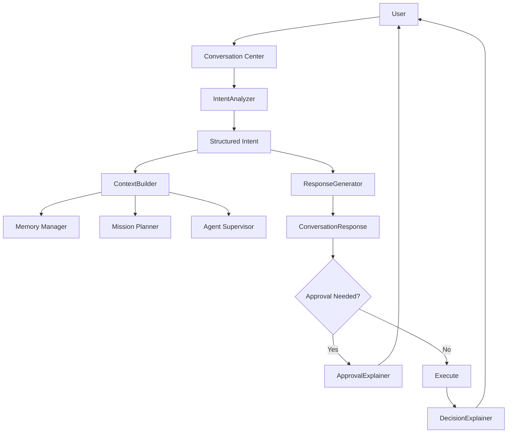
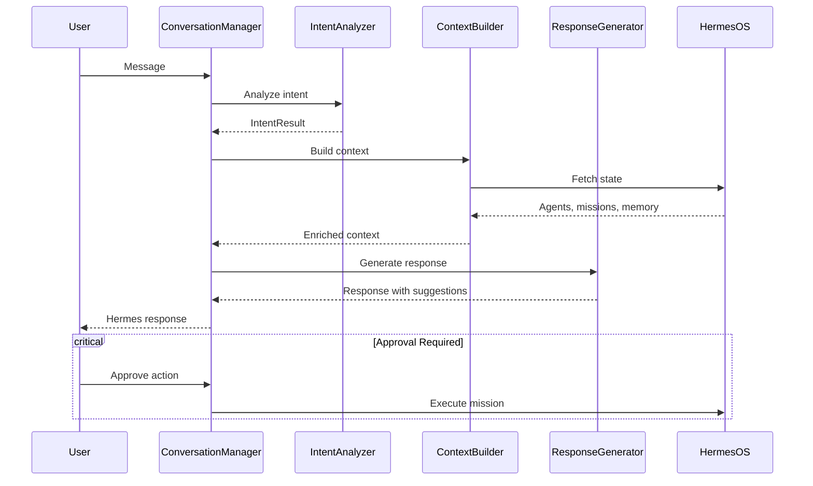

# Human Experience & Natural Interaction Layer

## HOS-064

---

## 1. Overview

The Human Experience Layer transforms Hermes OS from a technical orchestration system into a natural conversational partner. It enables users to interact with Hermes through natural language, understand its decisions, and control missions through an intuitive chat interface.

### Design Principles

- **Conversation-first** — All interactions start with natural language
- **Explainability** — Every AI decision comes with a human-readable explanation
- **Safe by design** — Critical actions require human approval with clear risk assessment
- **Voice-ready** — Architecture prepared for speech I/O without mandating it

---

## 2. Architecture

## 3. Conversation Flow

## 4. Modules

### 4.1 Conversation Module

| Component | File | Purpose |
|---|---|---|
| ConversationManager | `conversation_manager.py` | Session management, message routing |
| IntentAnalyzer | `intent_analyzer.py` | NL intent detection (11 types) |
| ContextBuilder | `context_builder.py` | System state enrichment |
| ResponseGenerator | `response_generator.py` | Contextual response generation |
| Routes | `routes.py` | REST API + WebSocket |

**Intents supportés :**

| Intent | Exemple | Confiance |
|---|---|---|
| OPTIMIZATION | "Optimise les performances" | 85% |
| ANALYSIS | "Analyse mon projet" | 90% |
| DEBUG | "J\'ai un bug" | 92% |
| REFACTOR | "Refactorise le code" | 85% |
| DOCUMENTATION | "Documente l\'API" | 80% |
| COMMAND | "Crée une app" | 75% |
| GREETING | "Bonjour" | 95% |
| APPROVAL | "Oui, approuve" | 95% |
| CANCEL | "Annule" | 90% |
| QUESTION | "Qu\'est-ce que..." | 60% |

### 4.2 Explainability Module

| Component | File | Purpose |
|---|---|---|
| DecisionExplainer | `decision_explainer.py` | Human-readable decision explanations |
| ExplanationModels | `explanation_models.py` | Decision types, risk levels, alternatives |
| Routes | `routes.py` | Explain API endpoints |

### 4.3 Approval Flow

| Component | File | Purpose |
|---|---|---|
| ApprovalExplainer | `approval_explainer.py` | Structured approval requests with risk |

### 4.4 Voice Interfaces

| Component | File | Purpose |
|---|---|---|
| SpeechToTextProvider | `speech_to_text.py` | Abstract STT (Whisper, Cloud) |
| TextToSpeechProvider | `text_to_speech.py` | Abstract TTS (Piper, Cloud) |

## 5. REST API

### Conversation Endpoints

| Method | Path | Description |
|---|---|---|
| POST | `/conversation/start` | Create new session |
| POST | `/conversation/message` | Send message |
| GET | `/conversation/{id}` | Get session history |
| POST | `/conversation/{id}/approve` | Approve pending action |
| POST | `/conversation/{id}/cancel` | Cancel current action |
| GET | `/conversation/{id}/context` | Get active context |
| GET | `/conversation/sessions` | List active sessions |

### Explainability Endpoints

| Method | Path | Description |
|---|---|---|
| POST | `/explain` | Generate decision explanation |
| GET | `/explain/{id}` | Get explanation details |
| GET | `/explain/history` | List recent explanations |

## 6. Integration Points

| Hermes OS Module | Integration |
|---|---|
| AutonomousInterpreter (HOS-063) | Intent understanding |
| Memory Manager (HOS-047) | Context enrichment |
| Mission Planner (HOS-042) | Goal creation from intents |
| Agent Supervisor (HOS-043) | Active agent context |
| DecisionEngine (HOS-063) | Decision explanations |
| Security Engine (HOS-057) | Approval risk assessment |

## 7. WebSocket Architecture

Future implementation for real-time streaming:
- `/ws/conversation/{id}` — Message streaming
- Events: `mission.progress`, `agent.update`, `approval.required`, `decision.made`
