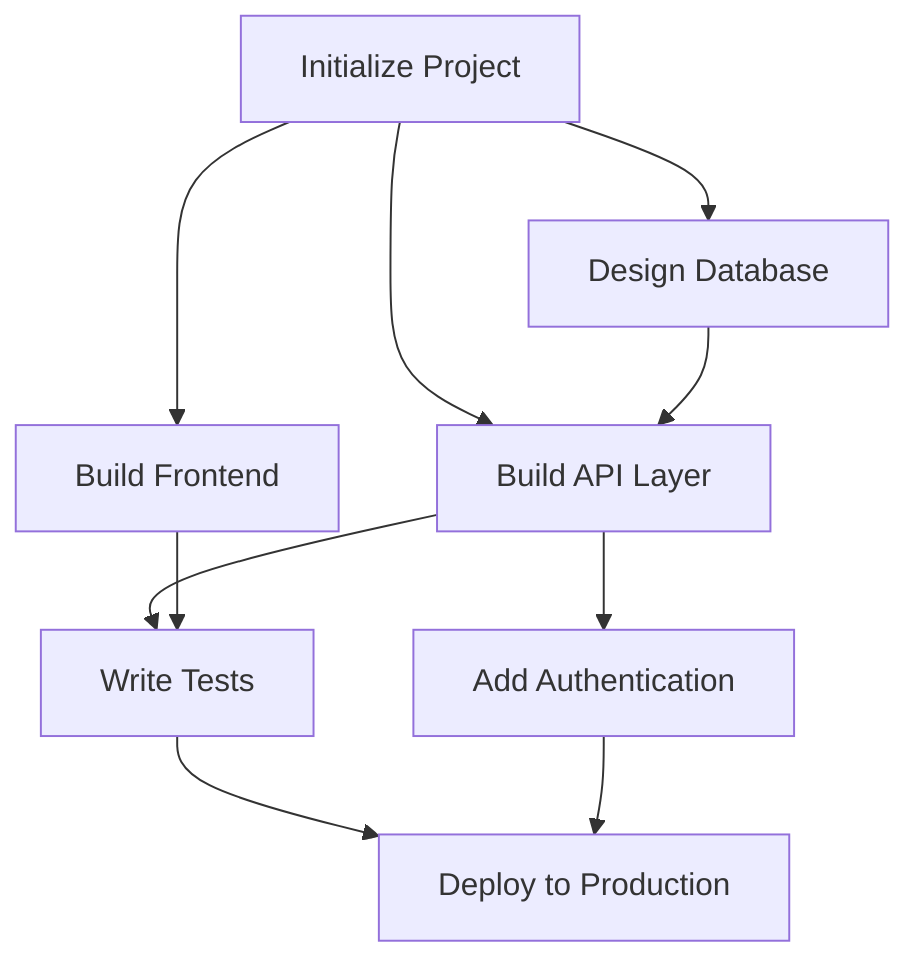

# Mission Graph Engine — Architecture (HOS-041)

> **Hermes OS** — DAG-based mission representation and execution engine.

---

## Overview

The Mission Graph Engine is the foundation for all multi-agent workflows in Hermes OS.
Every mission is represented as a **Directed Acyclic Graph (DAG)** where:

- **Nodes** = Tasks (MissionNode)
- **Edges** = Dependencies (MissionEdge → `source_id` depends on `target_id`)



---

## Components

| Component | File | Responsibility |
|---|---|---|
| `Mission` | `mission_models.py` | Root entity: nodes, edges, context, status, progress |
| `MissionNode` | `mission_models.py` | Task: title, deps, runtime prefs, skills, resources, validation |
| `MissionEdge` | `mission_models.py` | Dependency link: source → target |
| `MissionGraph` | `mission_graph.py` | DAG construction, cycle detection (Kahn's algorithm), topological sort |
| `DependencyResolver` | `dependency_resolver.py` | Ready/blocked nodes, parallel groups, cascade on failure |
| `GraphExecutor` | `graph_executor.py` | Mission lifecycle, step execution, event publishing |
| `GraphSerializer` | `graph_serializer.py` | JSON/YAML import/export with schema versioning |

---

## Key Algorithms

### Cycle Detection — Kahn's Algorithm
```
1. Compute in-degree for each node
2. Queue all nodes with in-degree = 0
3. While queue not empty:
   a. Pop node, increment visited count
   b. For each outgoing edge, decrement in-degree
   c. If in-degree becomes 0, enqueue
4. If visited < total nodes → cycle detected
```

### Parallel Groups
Nodes at the same topological level can run in parallel:
```
Level 0: [init]
Level 1: [db, frontend]       ← parallel
Level 2: [api, tests]         ← sequential (api depends on db)
Level 3: [auth]               ← sequential
Level 4: [deploy]             ← final
```

### Cascade on Failure
When a node fails, all its dependents are marked `BLOCKED`:
```
db fails → api blocked → auth blocked → deploy blocked
```

---

## Node Status Lifecycle

```
PENDING → READY → RUNNING → COMPLETED
                              ↘ FAILED → BLOCKED (all dependents)
```

---

## API Endpoints

| Method | Endpoint | Description |
|---|---|---|
| `POST` | `/missions` | Create mission with nodes + edges |
| `GET` | `/missions` | List all missions |
| `GET` | `/missions/{id}` | Get mission details + progress |
| `GET` | `/missions/{id}/graph` | Get graph data (nodes, edges, parallel groups) |
| `POST` | `/missions/{id}/start` | Start mission execution |
| `POST` | `/missions/{id}/cancel` | Cancel mission |
| `GET` | `/missions/{id}/progress` | Get progress breakdown |

---

## Events

| Event | When |
|---|---|
| `mission.created` | Mission DAG built |
| `mission.started` | Execution begins |
| `mission.node_ready` | Node dependencies satisfied |
| `mission.node_completed` | Node executed successfully |
| `mission.node_failed` | Node execution failed |
| `mission.completed` | All nodes completed |
| `mission.cancelled` | Mission cancelled |

---

## Example: Software Development Project

```json
{
  "schema_version": "1.0.0",
  "title": "Build REST API",
  "nodes": [
    {"node_id": "init", "title": "Initialize Project", "depends_on": []},
    {"node_id": "db", "title": "Design Database", "depends_on": ["init"]},
    {"node_id": "api", "title": "Build API Layer", "depends_on": ["init", "db"]},
    {"node_id": "frontend", "title": "Build Frontend", "depends_on": ["init"]},
    {"node_id": "auth", "title": "Add Authentication", "depends_on": ["api"]},
    {"node_id": "tests", "title": "Write Tests", "depends_on": ["api", "frontend"]},
    {"node_id": "deploy", "title": "Deploy to Production", "depends_on": ["tests", "auth"]}
  ],
  "edges": [
    {"source_id": "init", "target_id": "db"},
    {"source_id": "init", "target_id": "frontend"},
    {"source_id": "init", "target_id": "api"},
    {"source_id": "db", "target_id": "api"},
    {"source_id": "api", "target_id": "auth"},
    {"source_id": "api", "target_id": "tests"},
    {"source_id": "frontend", "target_id": "tests"},
    {"source_id": "tests", "target_id": "deploy"},
    {"source_id": "auth", "target_id": "deploy"}
  ]
}
```

Execution order: `init → [db, frontend] → api → [auth, tests] → deploy`
