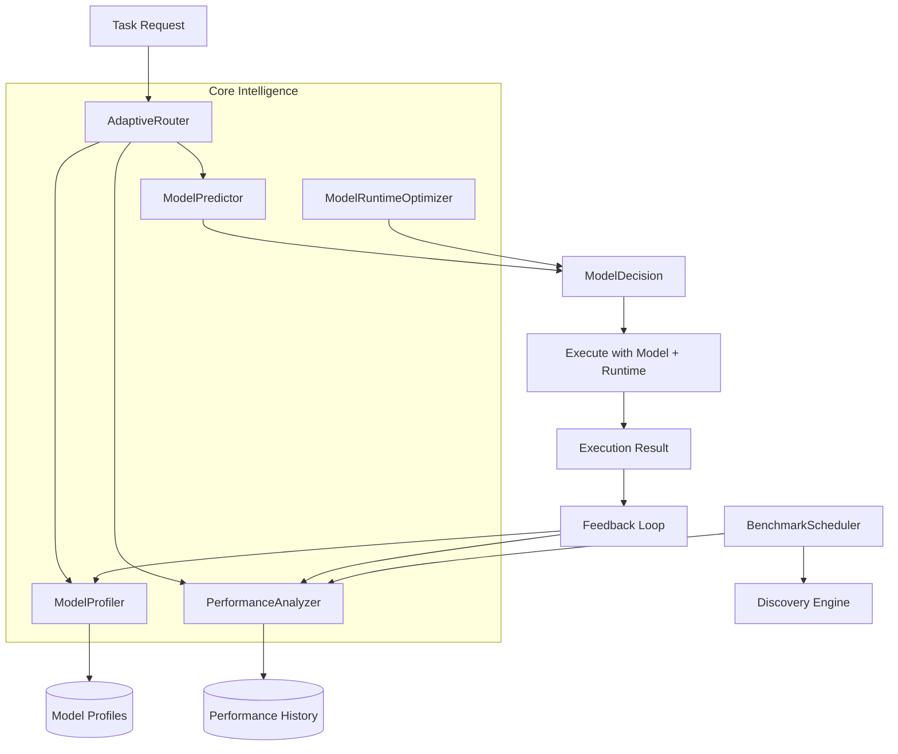
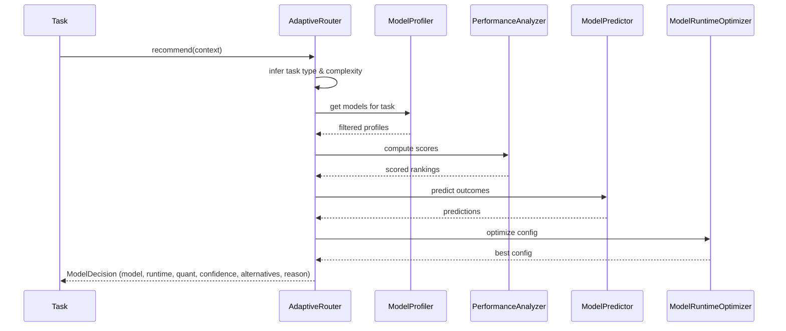

# Model Intelligence & Adaptive Routing Layer

## HOS-065

---

## 1. Overview

The Model Intelligence & Adaptive Routing Layer transforms model selection from a static configuration into an intelligent, adaptive decision system. It continuously analyzes performance, predicts outcomes, and recommends the optimal model, runtime, and quantization for every task based on real execution history.

### Design Principles

- **Data-driven** — Every recommendation is backed by historical performance data
- **Adaptive** — Scoring weights evolve based on actual execution results
- **Explainable** — Each decision includes confidence scores and alternatives
- **Resource-aware** — VRAM, RAM, and compute constraints are always respected
- **Self-improving** — The system learns from successes and failures over time

---

## 2. Architecture



---

## 3. Components

### 3.1 Models (`model_intelligence_models.py`)

Core data structures defining the model intelligence domain.

| Class/Enum | Description |
|---|---|
| `ModelProfile` | Model metadata, VRAM/RAM requirements, task scores, performance stats |
| `TaskContext` | Task characteristics (type, complexity, constraints, security) |
| `ModelDecision` | Recommended model, runtime, quantization, with confidence and reason |
| `ModelPerformanceRecord` | Single execution outcome (duration, tokens, success/failure) |
| `BenchmarkResult` | Benchmark metrics (latency, TPS, VRAM, quality score) |
| `ModelArchitecture` | `LLAMA`, `QWEN`, `MISTRAL`, `DEEPSEEK`, `PHI`, `CODELLAMA` |
| `TaskType` | 10 types: `CODE_GENERATION`, `REVIEW`, `DEBUG`, `REFACTOR`, `ANALYSIS`, `CHAT`, `DOCUMENTATION`, `OPTIMIZATION`, `REASONING`, `GENERAL` |
| `RuntimeBackend` | `OLLAMA`, `KTRANSFORMERS`, `VLLM`, `LLAMA_CPP`, `TRANSFORMERS` |
| `Quantization` | `Q4_K_M`, `Q5_K_M`, `Q6_K`, `Q8_0`, `F16` |

**Predefined Models (6):**

| ID | Name | Architecture | VRAM | Best At |
|---|---|---|---|---|
| `qwen3-coder-30b` | Qwen3-Coder 30B | QWEN | 18000 MB | Code generation, review |
| `deepseek-coder-16b` | DeepSeek Coder 16B | DEEPSEEK | 10000 MB | Debug, refactor |
| `codellama-7b` | CodeLlama 7B | CODELLAMA | 6000 MB | Code generation, analysis |
| `mistral-7b` | Mistral 7B | MISTRAL | 4000 MB | Chat, documentation |
| `llama3.2-3b` | Llama 3.2 3B | LLAMA | 2000 MB | Fast classification |
| `phi3-14b` | Phi-3 14B | PHI | 8000 MB | Reasoning, analysis |

### 3.2 Model Profiler (`model_profiler.py`)

**Purpose:** Central registry of all known models with performance tracking.

**Functions:**
- `get_profile(model_id)` — Retrieve model profile by ID
- `register_model(profile)` — Add a new model to the registry
- `list_profiles()` — All profiles sorted by overall score (descending)
- `get_top_models(limit, task_type)` — Top N models globally or per task
- `get_models_for_task(task_type, max_vram_mb)` — Filter models by task suitability and VRAM
- `update_performance(record)` — Update model stats after execution (total_runs, avg_duration, success_rate)
- `get_performance_history(model_id)` — All performance records for a model
- `get_stats()` — Registry summary stats

### 3.3 Performance Analyzer (`performance_analyzer.py`)

**Purpose:** Computes dynamic ModelScore from multiple weighted factors.

**Scoring Formula:**
```
ModelScore = quality × 0.30 + speed × 0.20 + reliability × 0.25 
           + resource_efficiency × 0.15 + benchmark_score × 0.10
```

**Functions:**
- `compute_model_score(profile, benchmarks)` — Full 5-factor score
- `compute_quality_score(profile, benchmarks)` — Task score average + benchmark quality
- `add_benchmark(result)` — Store benchmark result
- `get_benchmark_summary(model_id)` — Summary stats for model or all models
- `get_leaderboard()` — Ranked model list with scores

### 3.4 Model Predictor (`model_predictor.py`)

**Purpose:** Predicts execution characteristics before a task runs.

**Functions:**
- `predict_latency(model_id, task_type)` — Estimated duration in ms
- `predict_tokens_per_second(model_id)` — Estimated TPS
- `predict_success_probability(model_id, task_type)` — Success chance 0-1
- `predict_vram_usage(model_id)` — Estimated VRAM consumption
- `rank_models(context)` — Rank all models for a given task context

### 3.5 Adaptive Router (`adaptive_router.py`)

**Purpose:** Primary entry point for model recommendation.

**Functions:**
- `recommend(context, max_vram_mb)` — Full recommendation with model, runtime, quantization, alternatives, explanation
- `_infer_task_type(text)` — Text-based task type inference from keywords/phrases
- `_infer_complexity(text)` — Estimate complexity (low/medium/high) from text length and signals
- `_inherit_security(text)` — Detect security-sensitive keywords
- `_select_runtime(profile)` — Choose best runtime backend for model
- `_select_quantization(profile, context)` — Choose best quantization level
- `_get_probability_reason(confidence)` — Human-readable confidence label

### 3.6 Benchmark Scheduler (`benchmark_scheduler.py`)

**Purpose:** Periodic and on-demand benchmarking of all models.

**Functions:**
- `run_benchmarks(task_types)` — Full benchmark cycle for specified or all task types
- `_run_single_benchmark(model_id, task_type)` — Single benchmark execution
- `get_latest_benchmarks(model_id)` — Most recent benchmark results
- `detect_regression(model_id)` — Compare current vs previous benchmark to find regressions
- `get_benchmark_summary()` — High-level benchmark status

### 3.7 Model Runtime Optimizer (`model_runtime_optimizer.py`)

**Purpose:** Co-optimize model + runtime + quantization + hardware.

**Functions:**
- `optimize(profile, context, system_info)` — Find optimal configuration
- `_estimate_vram(model, runtime, quant)` — VRAM estimation for combination
- `_estimate_tps(model, runtime, quant)` — TPS estimation
- `_rank_combinations(candidates)` — Score and rank all valid combinations
- `get_optimization_plan(profile, context, system_info)` — Full optimization plan with alternatives

---

## 4. Decision Flow



---

## 5. Scoring Weights

| Factor | Weight | Description |
|---|---|---|
| **Quality** | 30% | Task-specific score + benchmark quality |
| **Speed** | 20% | Tokens per second relative to max |
| **Reliability** | 25% | Historical success rate + consistency |
| **Resource Efficiency** | 15% | VRAM usage vs threshold |
| **Benchmark** | 10% | Latest benchmark quality score |

---

## 6. Learning Loop

```
Execution Complete
        ↓
Record: model, duration, tokens, success, errors
        ↓
Update: ModelProfile.total_runs, success_rate, avg_duration
        ↓
Add: ModelPerformanceRecord to history
        ↓
Analyze: Update task_scores, benchmark averages
        ↓
Re-rank: Next request gets updated scores
```

---

## 7. REST API

| Endpoint | Method | Description |
|---|---|---|
| `/models/intelligence` | GET | Intelligence stats (models, benchmarks, history count) |
| `/models/ranking` | GET | Ranked model list with scores |
| `/models/recommend` | POST | Recommend model for a task context |
| `/models/history` | GET | Performance history for a model |
| `/models/benchmark` | POST | Run benchmarks |
| `/models/performance` | GET | Performance summary |
| `/models/optimize` | POST | Get optimization plan |

---

## 8. Predefined Task Types

| Task Type | Keywords | Best Model |
|---|---|---|
| `code_generation` | generate, create, write, implement, build, develop | Qwen3-Coder 30B |
| `code_review` | review, inspect, audit | Qwen3-Coder 30B |
| `debug` | debug, fix, error, bug, issue, broken | DeepSeek Coder 16B |
| `refactor` | refactor, clean, optimize, rewrite, migrate | DeepSeek Coder 16B |
| `analysis` | analyze, understand, explain, what | DeepSeek Coder 16B |
| `chat` | hi, hello, how, what is | Mistral 7B |
| `documentation` | document, write docs, readme | Mistral 7B |
| `optimization` | optimize, performance, faster | Qwen3-Coder 30B |
| `reasoning` | reason, think, logical | Phi-3 14B |
| `general` | (catch-all) | Mistral 7B |

---

## 9. Integration Points

| Hermes Module | Integration |
|---|---|
| Model Discovery (HOS-040) | Discovery Engine feeds new models to BenchmarkScheduler |
| Runtime Orchestrator (HOS-038) | ModelRuntimeOptimizer selects backend runtime |
| Simulation Engine (HOS-039) | Predicted vs actual performance comparison |
| Autonomous Core (HOS-063) | DecisionEngine uses AdaptiveRouter for model decisions |
| Evolution Engine (HOS-058) | PerformanceAnalyzer feeds improvement suggestions |
| Explainability (HOS-064) | DecisionExplainer formats model selection explanations |
