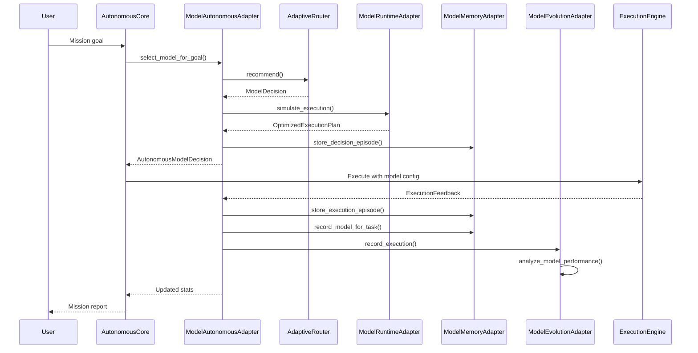

# Model Intelligence Final Integration Architecture

## HOS-065B

---

## 1. Overview

HOS-065B completes the Model Intelligence Layer by connecting it deeply with Hermes OS's core systems. The Adaptive Router is no longer a standalone recommender — it becomes part of the system's adaptive brain, learning from every mission, feeding the Evolution Engine, storing decisions in memory, and explaining its reasoning.

### Integration Map

```
                         ┌──────────────────────┐
                         │   Autonomous Core     │
                         │      (HOS-063)        │
                         └──────┬───────────────┘
                                │ goal-driven model selection
                                ▼
┌─────────────────────────────────────────────────────────────┐
│                   Model Intelligence                         │
│                                                              │
│  ┌────────────────┐  ┌────────────────┐  ┌────────────────┐ │
│  │ModelAutonomous │  │ ModelRuntime   │  │ModelEvolution  │ │
│  │Adapter         │──│ Adapter        │  │Adapter         │ │
│  └───────┬────────┘  └───────┬────────┘  └───────┬────────┘ │
│          │                   │                    │          │
│  ┌───────┴────────────────────────────────────────┴────────┐ │
│  │                  ModelMemoryAdapter                      │ │
│  └───────┬────────────────────────────────────────┬────────┘ │
└──────────┼────────────────────────────────────────┼──────────┘
           │                                        │
           ▼                                        ▼
    ┌─────────────┐                        ┌──────────────┐
    │  Episodic   │◄──── Knowledge ────►   │    Unified   │
    │  Memory     │      Graph              │    Memory    │
    └─────────────┘                        │   (HOS-047)  │
                                           └──────────────┘
```

---

## 2. Components

### 2.1 ModelAutonomousAdapter (`model_autonomous_adapter.py`)

**Purpose:** Bridges AdaptiveRouter with Autonomous Core (HOS-063) for goal-driven model selection.

| Method | Description |
|---|---|
| `select_model_for_goal()` | Select optimal model for an autonomous mission goal |
| `record_feedback()` | Record execution feedback and update model profiler |
| `record_selection_completed()` | Mark model selection as completed |
| `get_decision_history()` | Query past model decisions |
| `get_stats()` | Decision count, success rate, most used models |

**Events Published:**

| Event | When |
|---|---|
| `model.decision.created` | A model decision was made for a goal |
| `model.selection.completed` | Model selection cycle completed |
| `model.performance.updated` | Execution feedback was recorded |
| `model.routing.optimized` | Model routing was optimized |

### 2.2 ModelRuntimeAdapter (`model_runtime_adapter.py`)

**Purpose:** Connects Model Intelligence with Runtime Orchestrator, Simulation Engine, and Resource Manager for pre-execution simulation.

| Method | Description |
|---|---|
| `simulate_execution()` | Full model+runtime+hardware simulation |
| `compare_runtimes()` | Compare model across different runtime backends |
| `get_best_configuration()` | Single best config for a model |
| `update_system_info()` | Update hardware specs for simulation accuracy |

### 2.3 ModelEvolutionAdapter (`model_evolution_adapter.py`)

**Purpose:** Connects PerformanceAnalyzer with Evolution Engine (HOS-058) for continuous improvement.

| Method | Description |
|---|---|
| `analyze_model_performance()` | Performance trends, success rates, degradation detection |
| `detect_underperforming_models()` | Find models below success threshold |
| `suggest_model_replacement()` | Recommend better model alternatives |
| `update_weights()` | Update scoring weights (called by Evolution Engine) |
| `get_evolution_summary()` | Full summary for Evolution Engine consumption |

### 2.4 ModelMemoryAdapter (`model_memory_adapter.py`)

**Purpose:** Stores model decisions and performance in Episodic Memory, Procedural Memory, and Knowledge Graph.

| Method | Memory Type | Description |
|---|---|---|
| `store_execution_episode()` | Episodic | Store model execution as an episode |
| `store_decision_episode()` | Episodic | Store model selection decision |
| `query_episodic_memory()` | Episodic | Query past model executions |
| `learn_effective_rule()` | Procedural | Store effective decision rules |
| `reinforce_rule()` | Procedural | Reinforce/weaken rules based on outcomes |
| `query_procedural_memory()` | Procedural | Find matching decision rules |
| `add_kg_relation()` | Knowledge Graph | Add any KG relation |
| `record_model_for_task()` | Knowledge Graph | MODEL_USED_FOR_TASK relation |
| `record_outperformance()` | Knowledge Graph | MODEL_OUTPERFORMED_MODEL relation |
| `get_best_model_for_task()` | Knowledge Graph | Query best model by task |

---

## 3. Full Mission Flow



---

## 4. Knowledge Graph Relations

| Relation | Source | Target | Meaning |
|---|---|---|---|
| `MODEL_USED_FOR_TASK` | model_id | task_type | Model was used for this task type |
| `MODEL_OUTPERFORMED_MODEL` | winner_id | loser_id | Model performed better than another |
| `MODEL_RECOMMENDED_BY_CONTEXT` | model_id | context_desc | Model was recommended for this context |

---

## 5. Evolution Feedback Loop

```
Mission Complete
       │
       ▼
Record Execution (duration, tokens, success, errors)
       │
       ▼
Update ModelProfile (total_runs, success_rate, avg_duration)
       │
       ▼
Analyze Trends (recent vs historical performance)
       │
       ▼
Detect Underperformance (success_rate < 0.7 or degrading trend)
       │
       ▼
Suggest Replacement (find better model within VRAM budget)
       │
       ▼
Adjust Scoring Weights (quality/speed/reliability/efficiency/benchmark)
       │
       ▼
Next Mission gets improved recommendations
```

---

## 6. Test Coverage

| Test Class | Tests | Coverage |
|---|---|---|
| `TestModelAutonomousAdapter` | 9 | Goal selection, feedback, events, thread safety |
| `TestModelRuntimeAdapter` | 5 | Simulation, runtime comparison, config |  
| `TestModelEvolutionAdapter` | 9 | Performance analysis, weights, underperformance |
| `TestModelMemoryAdapter` | 10 | Episodic, procedural, KG, thread safety |
| `TestFullMissionSimulation` | 3 | Complete end-to-end scenarios |
| **Total** | **36** | |

---

## 7. Scoring Weights (Dynamic)

| Factor | Default | Range | Controlled By |
|---|---|---|---|
| **Quality** | 0.30 | 0.05–0.60 | Evolution Engine |
| **Speed** | 0.20 | 0.05–0.60 | Evolution Engine |
| **Reliability** | 0.25 | 0.05–0.60 | Evolution Engine |
| **Resource Efficiency** | 0.15 | 0.05–0.60 | Evolution Engine |
| **Benchmark** | 0.10 | 0.05–0.60 | Evolution Engine |

Weights are automatically normalized to sum to 1.0 after each adjustment.
