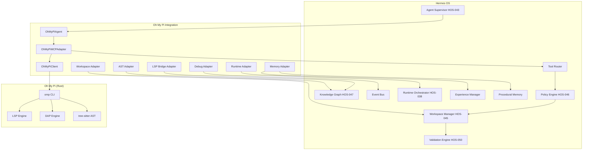

# Oh My Pi Deep Integration Architecture

## HOS-055C

---

## 1. Overview

Oh My Pi (`can1357/oh-my-pi`) is a high-performance AI coding agent built in Rust (~55K lines). Hermes integrates it as a **specialized agent + MCP tool provider** focused on:

- **LSP** — Language Server Protocol for real-time code intelligence
- **DAP** — Debug Adapter Protocol for interactive debugging
- **AST** — tree-sitter based structural code manipulation
- **Code Execution** — sandboxed Python/JavaScript execution
- **Git Operations** — branch, commit, diff via CLI

Hermes retains: orchestration, governance, memory, planning, knowledge graph, and validation.

---

## 2. Architecture Overview



---

## 3. Component Details

### 3.1 LSP Bridge Adapter (`lsp_bridge_adapter.py`)

Bridges LSP analysis from Oh My Pi into Hermes Knowledge Graph.

| Method | Description |
|---|---|
| `index_symbols(file, symbols)` | Index LSP symbols into dict + KG |
| `index_diagnostics(file, diags)` | Index diagnostics by file |
| `index_structure(struct)` | Index CodeStructure + symbols |
| `find_symbol(name, file)` | Find symbol by name (optional file filter) |
| `find_references(name)` | Find all references to a symbol |
| `get_diagnostics(file)` | Get diagnostics (by file or all) |
| `get_code_structure(file)` | Get cached CodeStructure |

**KG Relations**: File → DEFINES → Symbol, File → HAS_DIAGNOSTIC

### 3.2 AST Adapter (`ast_adapter.py`)

Exploits Oh My Pi's tree-sitter for structural code analysis.

| Method | Description |
|---|---|
| `index_ast(file, ast_data)` | Index AST nodes into Knowledge Graph |
| `get_ast(file)` | Retrieve cached AST for a file |
| `detect_functions(file)` | Extract function nodes |
| `detect_classes(file)` | Extract class nodes |
| `detect_imports(file)` | Extract import nodes |
| `detect_dependencies(file)` | Build dependency graph |
| `estimate_complexity(file)` | Return complexity metrics |

**KG Relations**: File → CONTAINS_FUNCTION, File → CONTAINS_CLASS, Function → CALLS, File → IMPORTS, File → DEPENDS_ON

### 3.3 Debug Adapter (`debug_adapter.py`)

Integrates DAP sessions into Hermes.

| Method | Description |
|---|---|
| `create_session(file)` | Create DAP debug session |
| `add_breakpoint(file, line, condition?)` | Add breakpoint to session |
| `update_stack(frames)` | Update call stack |
| `get_variables()` | Get local variables |
| `record_incident(error)` | Record debug incident |
| `complete_session()` | Mark session completed |
| `stats()` | Debug session statistics |

**EventBus Events**: `ohmypi.debug.*`

### 3.4 Workspace Adapter (`workspace_adapter.py`)

Connects Oh My Pi edits to Hermes Workspace Manager.

| Method | Description |
|---|---|
| `prepare_edit(file, content, agent)` | Create Git branch, sandbox file |
| `commit_edit(file, message, agent)` | Commit and validate edit |
| `rollback_edit(file, agent)` | Rollback to pre-edit state |
| `validate_edit_path(file)` | Check file is in workspace |
| `edit_count()` | Total edits tracked |
| `stats()` | Workspace adapter statistics |

**Pipeline**: Edit → WorkspaceManager → Sandbox → Git branch → Validation → Commit

### 3.5 Runtime Adapter (`runtime_adapter.py`)

Exposes Oh My Pi as a runtime candidate for the Runtime Orchestrator.

| Method | Description |
|---|---|
| `get_info()` | Runtime info (type, capabilities, status) |
| `get_suitability(task, context)` | Score 0-1 for a given task |
| `recommend(task, context)` | Recommend or not (threshold 0.5) |
| `register(runtime_registry)` | Register in Runtime Registry |
| `stats()` | Runtime adapter statistics |

**Context modifiers**: `{"debug": true}` boosts score, `{"documentation": true}` lowers it.

### 3.6 Memory Adapter (`memory_adapter.py`)

Records Oh My Pi experiences into Hermes Memory System.

| Method | Description |
|---|---|
| `record_experience(task, result, duration_ms, files, error)` | Record episodic experience |
| `get_effective_corrections(limit)` | Get top corrections by success count |
| `find_pattern(error_keywords)` | Find matching code patterns |
| `add_code_pattern(pattern, language, context)` | Add a reusable code pattern |
| `stats()` | Memory adapter statistics |

---

## 4. Data Flow Examples

### 4.1 LSP Analysis Pipeline

```
OhMyPiAgent.execute_task("code_analysis", {file})
  → OhMyPiMCPAdapter.call_tool("lsp_open_file", {file})
  → OhMyPiClient.execute("lsp", file)
  → omp lsp open <file>
  → LSP symbols + diagnostics returned
  → LSPBridge.index_symbols(file, symbols)
  → LSPBridge.index_diagnostics(file, diagnostics)
  → Knowledge Graph updated (file → DEFINES → symbol nodes)
  → EventBus: ohmypi.lsp.symbols_indexed
  → EventBus: ohmypi.lsp.diagnostics
```

### 4.2 Code Edit Pipeline

```
OhMyPiAgent.execute_task("code_editing", {file, content})
  → OhMyPiAgent._execute_with_workspace_protection()
  → WorkspaceAdapter.prepare_edit(file, content, agent)
    → WorkspaceManager.create_workspace()
    → SandboxManager.isolate()
    → GitWorkspace.create_branch()
  → OhMyPiMCPAdapter.call_tool("lsp_edit", {file, content})
  → OhMyPiClient.execute("edit", file, content)
  → WorkspaceAdapter.commit_edit(file, message, agent)
    → Validation Engine validates
    → Git commit
  → MemoryAdapter.record_experience(...)
  → EventBus: ohmypi.edit.completed
```

### 4.3 Debug Session Pipeline

```
OhMyPiAgent.execute_task("debugging", {file})
  → DebugAdapter.create_session(file)
  → OhMyPiMCPAdapter.call_tool("debug_start", {file})
  → EventBus: ohmypi.debug.started
  → [User/Agent steps through code]
  → DebugAdapter.add_breakpoint(file, line)
  → OhMyPiMCPAdapter.call_tool("debug_step", {action: "step_over"})
  → DebugAdapter.update_stack(frames)
  → DebugAdapter.complete_session()
  → MemoryAdapter.record_experience(...)
  → EventBus: ohmypi.debug.completed
```

---

## 5. Hermes ↔ Oh My Pi Responsibility Split

| Capability | Hermes | Oh My Pi | Integration |
|---|---|---|---|
| **Code Intelligence (LSP)** | ❌ | ✅ omp LSP | LSP Bridge → KG |
| **Debugging (DAP)** | ❌ | ✅ omp DAP | Debug Adapter → EventBus |
| **AST Manipulation** | ❌ | ✅ tree-sitter | AST Adapter → KG |
| **Code Execution** | ❌ | ✅ Python/JS sandbox | MCP adapter |
| **Code Editing** | ✅ Policy/Validation | ✅ LSP-wired edits | Workspace Adapter |
| **Code Analysis** | ✅ KlaatCode | ✅ LSP symbols | Complementary |
| **LLM Routing** | ✅ Runtime Orch. | ✅ 40+ providers | Runtime Adapter |
| **Memory** | ✅ Full memory stack | ❌ | Memory Adapter |
| **Planning** | ✅ Mission DAG | ❌ | Hermes only |
| **Governance** | ✅ Policy Engine | ❌ | Hermes only |
| **Knowledge Graph** | ✅ Unified KG | ❌ | Hermes only |

---

## 6. EventBus Events

| Event | Source | Payload |
|---|---|---|
| `ohmypi.lsp.symbols_indexed` | LSPBridge | file, count |
| `ohmypi.lsp.diagnostics` | LSPBridge | file, errors, warnings |
| `ohmypi.ast.indexed` | ASTAdapter | file, nodes, functions, classes |
| `ohmypi.debug.started` | DebugAdapter | session_id, file |
| `ohmypi.debug.breakpoint` | DebugAdapter | file, line |
| `ohmypi.debug.failed` | DebugAdapter | session_id, error |
| `ohmypi.debug.completed` | DebugAdapter | session_id, incidents |
| `ohmypi.workspace.edit_prepared` | WorkspaceAdapter | file, agent_id |
| `ohmypi.workspace.edit_committed` | WorkspaceAdapter | file, agent_id |
| `ohmypi.workspace.edit_rolled_back` | WorkspaceAdapter | file, agent_id |
| `ohmypi.runtime.recommended` | RuntimeAdapter | task_type, score |
| `ohmypi.memory.experience_recorded` | MemoryAdapter | task_type, success |
| `ohmypi.memory.pattern_added` | MemoryAdapter | pattern_id |

---

## 7. Test Coverage

| Test Class | Count | Area |
|---|---|---|
| TestLSPBridge | 10 | Symbol indexing, diagnostics, structure, references |
| TestASTAdapter | 10 | Functions, classes, imports, deps, complexity |
| TestDebugAdapter | 8 | Sessions, breakpoints, stack, variables, incidents |
| TestWorkspaceAdapter | 8 | Edit lifecycle, validation, rollback |
| TestRuntimeAdapter | 8 | Suitability, recommendation, registration |
| TestMemoryAdapter | 8 | Experience recording, corrections, patterns |
| TestOhMyPiDeepEvents | 4 | Event emission verification |
| TestOhMyPiDeepThreadSafety | 3 | Concurrent adapter operations |
| **Total** | **58** | — |

Combined with HOS-055B: **112 tests total**.

---

## 8. KlaatCode ↔ Oh My Pi Complementarity

| Task | KlaatCode (HOS-054) | Oh My Pi (HOS-055) |
|---|---|---|
| Project Analysis | ✅ `analyze_project` | — |
| Code Intelligence | — | ✅ LSP symbols + diagnostics |
| AST Manipulation | — | ✅ tree-sitter transforms |
| Debugging | — | ✅ DAP sessions |
| Code Execution | — | ✅ Python/JS sandbox |
| Code Editing | basic `edit_file` | ✅ **LSP-wired** `lsp_edit` |
| Diagnostics | ✅ `run_diagnostics` | ✅ LSP diagnostics (complementary) |
| Validation | ✅ `validate_changes` | ✅ + workspace validation |
| LLM Routing | — | ✅ 40+ providers |

**Rule**: Use **Oh My Pi** when the task involves LSP, DAP, AST, or code execution. Use **KlaatCode** for project-level analysis, planning, and validation. The Agent Supervisor's CapabilityMatcher selects the best agent.

---

## 9. File Manifest

### Created (HOS-055C)

```
backend/integrations/ohmypi/
├── __init__.py              # Package exports
├── lsp_bridge_adapter.py    # LSP → Knowledge Graph bridge
├── ast_adapter.py           # tree-sitter AST → KG
├── debug_adapter.py         # DAP → EventBus
├── workspace_adapter.py     # Oh My Pi → WorkspaceManager
├── runtime_adapter.py       # Runtime candidate scoring
└── memory_adapter.py        # Experience → Episodic/Procedural Memory

frontend/src/
├── types/hermes.ts          # +OhMyPiStatus, OhMyPiCapability, OhMyPiExecutionResult, LSPDiagnostic, LSPSymbol, DebugSession
├── services/client.ts       # +ohmypiClient (status, capabilities, execute)
└── features/tools/
    └── ohmypi-panel.tsx     # Cockpit panel

tests/architecture/
└── test_ohmypi_deep_integration.py  # 58 tests

docs/architecture/
└── OHMYPI_DEEP_INTEGRATION_ARCHITECTURE.md  # This document
```
