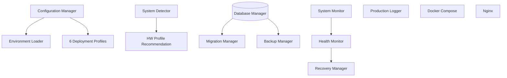
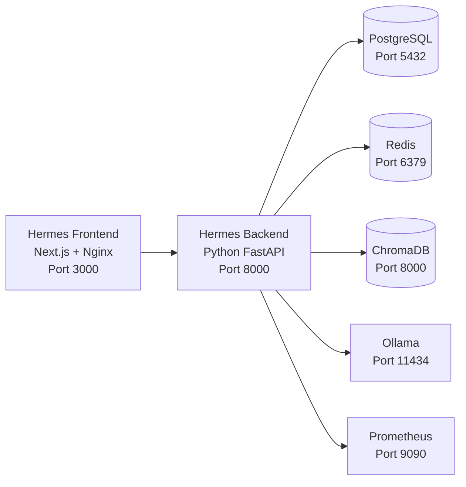

# Production Readiness & Deployment Layer

## HOS-062

---

## 1. Overview

The Production Readiness & Deployment Layer transforms Hermes OS from an
advanced functional architecture into an installable, configurable, deployable,
and maintainable production system.

### Components

| Module | Purpose |
|---|---|
| **Configuration** (`backend/config/`) | 6 deployment profiles, env var override, runtime config |
| **Installer** (`installer/`) | Hardware detection, profile recommendation |
| **Persistence** (`backend/storage/`) | Database management, migrations, backups |
| **Monitoring** (`backend/monitoring/`) | System metrics, health checks, crash recovery |
| **Logging** (`backend/logging/`) | Structured JSON logging, correlation IDs |
| **Deployment** (`deployment/`) | Dockerfiles, docker-compose, nginx config |

---

## 2. Architecture

## 3. Configuration System

### Profiles

| Profile | Use Case | GPU | DB | RAM Min |
|---|---|---|---|---|
| `local_gpu` | Desktop with NVIDIA GPU | ✓ | SQLite | 8 GB |
| `cpu_only` | No GPU / low RAM | ✗ | SQLite | 4 GB |
| `wsl` | Windows WSL2 | ~ | SQLite | 8 GB |
| `docker` | Container deployment | ✗ | PostgreSQL | 8 GB |
| `server` | Production server | ~ | PostgreSQL | 16 GB |
| `cloud_gpu` | Cloud with GPU | ✓ | PostgreSQL | 16 GB |

### Configuration Loading Order

1. Default values in `HermesConfig`
2. Profile JSON file (`backend/config/profiles/{name}.json`)
3. Environment variables (`HERMES_*`)
4. Runtime overrides

## 4. Deployment Architecture

## 5. Monitoring & Recovery

### System Monitor
- CPU, RAM, disk metrics every 30s (configurable)
- Service health check integration
- Alert threshold system (90% CPU/RAM/disk)
- 1000-entry metric history

### Health Monitor
- Component registration with check functions
- Configurable check intervals
- Consecutive failure tracking (3 → unhealthy)
- Unhealthy alert callbacks

### Recovery Manager
- Configurable max attempts (default: 3)
- Cooldown period (default: 60s)
- Per-component reset
- Full recovery history

## 6. Backup Strategy

| Type | Frequency | Retention | Location |
|---|---|---|---|
| Manual | On demand | User-defined | `backups/` |
| Auto | Every 24h | Latest only | `backups/` |
| Config export | Manual | User-defined | User path |

## 7. Production Recommendations

### Minimum Requirements
- **CPU**: 4 cores, 2.0 GHz+
- **RAM**: 8 GB (16 GB recommended)
- **Disk**: 20 GB free (50 GB recommended)
- **OS**: Linux (Ubuntu 22.04+, Debian 12+)

### GPU Requirements
- **NVIDIA**: Compute Capability 7.0+ (RTX 20 series+)
- **VRAM**: 4 GB minimum, 8 GB+ recommended
- **CUDA**: 11.8+
- **AMD ROCm**: 5.6+

### Security
- Always change default passwords
- Use strong JWT secrets (32+ chars)
- Enable SSL/TLS in production
- Restrict API access to internal network
- Regular backup rotation

### Performance
- Use PostgreSQL in production (not SQLite)
- Configure Redis for event bus persistence
- Enable connection pooling
- Set appropriate memory limits
- Monitor GPU temperature and memory
