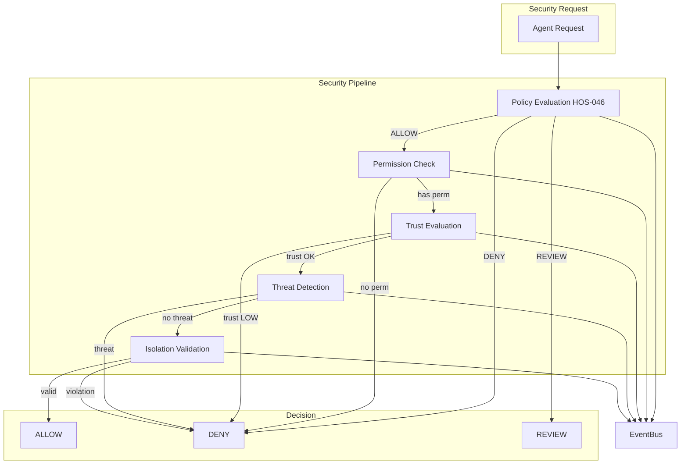

# Security, Sandbox & Trust Architecture

## HOS-057

---

## 1. Overview

The Security, Sandbox & Trust Layer provides comprehensive security for Hermes OS autonomous agents. It manages permissions, dynamic trust scoring, real-time threat detection, sandbox isolation, and integrates with the existing Policy Engine (HOS-046).

### Design Principles

- **Principle of Least Privilege** — Agents only access what they explicitly need
- **Defense in Depth** — Multiple security layers: Policy → Permission → Trust → Threat → Isolation
- **Dynamic Trust** — Trust scores evolve with agent behavior
- **No Duplication** — Integrates with existing HOS-046 Policy Engine, not replaces it
- **Auditable** — All security events are logged and publishable to EventBus

---

## 2. Architecture



---

## 3. Component Details

### 3.1 PermissionManager

Centralized permission management across all resource types.

| Method | Description |
|---|---|
| `grant_permission()` | Grant access to a resource |
| `revoke_permission()` | Revoke access |
| `check_permission()` | Check if principal has permission |
| `list_permissions()` | List permissions (optional filter by principal) |
| `add_policy()` | Add a security policy |
| `evaluate_policies()` | Evaluate matching policies (by priority) |

**Supported Resource Types**: `AGENT`, `SKILL`, `TOOL`, `WORKSPACE`, `RUNTIME`, `FILE`, `NETWORK`, `MEMORY`, `CONFIG`

### 3.2 AgentTrustEngine

Dynamic trust scoring (0-100) based on agent behavior.

| Factor | Weight | Description |
|---|---|---|
| `success_rate` | 30% | Historical task success |
| `policy_compliance` | 25% | Freedom from policy violations |
| `human_approvals` | 15% | Trust boosted by human approval |
| `recent_behavior` | 20% | Last 10 tasks success rate |
| `tenure` | 10% | Number of tasks completed (max 100) |

**Trust Levels**:

| Level | Min Score | Access |
|---|---|---|
| VERIFIED | 85 | Full access |
| HIGH | 60 | Most operations |
| MEDIUM | 35 | Restricted operations |
| LOW | 15 | Read-only / manual review |
| UNKNOWN | 0 | Default for new agents |

### 3.3 ThreatDetector

Real-time threat detection with 4 detection types.

| Detection | Description | Default Level |
|---|---|---|
| `unauthorized_file_access` | File access outside allowed paths | MEDIUM |
| `excessive_resource_usage` | CPU/RAM usage 3x threshold in 10s | HIGH |
| `suspicious_tool_call` | exec/shell tools called >10x in 60s | HIGH |
| `sandbox_violation` | Escape attempt | CRITICAL |

### 3.4 IsolationManager

Sandbox isolation with 5 levels.

| Level | Filesystem | Network | CPU | Memory | Duration |
|---|---|---|---|---|---|
| NONE | Full access | Open | 100% | Unlimited | Unlimited |
| LOW | /tmp, /home | Open | 100% | 1024MB | 3600s |
| MEDIUM | /tmp/workspace | Restricted | 50% | 512MB | 3600s |
| HIGH | /tmp/ws/project | Blocked | 25% | 256MB | 3600s |
| MAXIMUM | None | Blocked | 10% | 128MB | 300s |

### 3.5 SecurityEngine

Orchestrator that runs the full security pipeline:

```
1. Policy Evaluation (HOS-046 integration)
2. Permission Check
3. Trust Evaluation
4. Threat Detection
5. Isolation Validation
6. Allow / Deny / Review
```

---

## 4. EventBus Integration

### Published Events

| Event | Trigger | Payload |
|---|---|---|
| `security.permission.checked` | Permission check passed | principal, resource, operation, trust_score |
| `security.permission.denied` | Permission denied | principal, resource, reason |
| `security.threat.detected` | Threat detected | principal, threat level, type, evidence |
| `security.agent.trust.updated` | Trust score changed | agent_id, score, level |
| `security.isolation.created` | Isolation session started | session_id, profile_id, level |
| `security.isolation.violation` | Sandbox escape attempt | session_id, operation, target |

### Policy Engine Integration (HOS-046)

The Security Engine integrates with the existing Policy Engine by:
1. Evaluating all registered policies first (highest priority wins)
2. Policies can ALLOW, DENY, or require REVIEW
3. If no policy matches, default is DENY
4. Permissions are checked AFTER policies pass

---

## 5. File Manifest

```
backend/security/
├── __init__.py                  # Package exports
├── security_models.py           # 9 dataclasses, 7 enums, event types
├── permission_manager.py        # Central permission management
├── agent_trust_engine.py        # Dynamic trust scoring
├── threat_detector.py           # Real-time threat detection
├── isolation_manager.py         # Sandbox isolation profiles
├── security_engine.py           # Orchestrator (full pipeline)
└── routes.py                    # REST API handlers (9 endpoints)

frontend/src/
├── components/sidebar.tsx       # +"Security" navigation
└── features/security/
    └── security-center.tsx      # Cockpit panel

tests/security/
└── test_security_layer.py      # 75 tests (9 classes)

docs/architecture/
└── SECURITY_TRUST_ARCHITECTURE.md  # This document
```

---

## 6. API Endpoints

| Method | Path | Handler | Description |
|---|---|---|---|
| GET | `/security/status` | `handle_get_status` | Overall security status |
| GET | `/security/policies` | `handle_get_policies` | List policies |
| POST | `/security/check` | `handle_check_access` | Check access |
| GET | `/security/events` | `handle_get_events` | Security event history |
| GET | `/security/trust/{agent_id}` | `handle_get_trust` | Agent trust score |
| POST | `/security/permissions/grant` | `handle_grant_permission` | Grant permission |
| POST | `/security/permissions/revoke` | `handle_revoke_permission` | Revoke permission |
| GET | `/security/threats` | `handle_get_threats` | List threats |
| POST | `/security/threats/mitigate` | `handle_mitigate_threat` | Mitigate threat |

---

## 7. Test Coverage

| Test Class | Count | Area |
|---|---|---|
| TestSecurityModels | 14 | Data model integrity, serialization, defaults |
| TestPermissionManager | 12 | Grant, revoke, check, policies, priority, history |
| TestAgentTrustEngine | 12 | Scoring, violations, approvals, thresholds, notifications |
| TestThreatDetector | 12 | File access, resource usage, tool calls, sandbox, mitigation |
| TestIsolationManager | 11 | Profiles, sessions, validation, violations, stats |
| TestSecurityEngine | 7 | Pipeline, policy, trust, events |
| TestAPIRoutes | 6 | Status, policies, permissions, trust, events |
| TestSecurityThreadSafety | 5 | Concurrent permissions, trust, threats, isolation, engine |
| **Total** | **75** | — |
