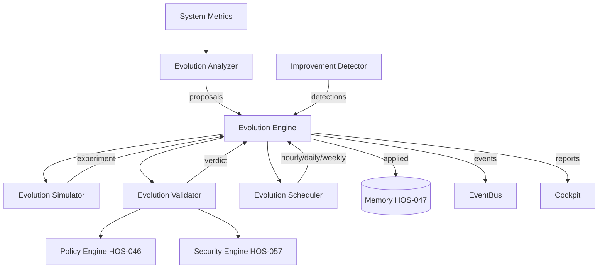

# Self Evolution & Continuous Improvement Engine

## HOS-058

---

## 1. Overview

The Self Evolution Engine enables Hermes OS to autonomously analyze its own performance, detect improvement opportunities, simulate changes, validate them through security/policy, apply safe optimizations, and learn from results — all without uncontrolled self-modification.

### Design Principles

- **Safe Evolution** — All changes pass through Policy Engine (HOS-046) and Security Engine (HOS-057)
- **Evidence-Based** — Every proposal requires metrics, simulation, and validation
- **Human-in-the-Loop** — High-risk changes require human approval
- **No Duplication** — Uses existing Runtime Simulation Engine (HOS-039) via the EvolutionSimulator
- **Continuous Learning** — Patterns discovered from past evolutions inform future decisions

---

## 2. Architecture



---

## 3. Component Details

### 3.1 EvolutionAnalyzer

Analyzes system metrics across 5 dimensions:

| Dimension | Metrics | Threshold | Proposal Type |
|---|---|---|---|
| Runtime | Latency > 500ms, Errors > 10%, Model score < 0.5 | 3 rules | RUNTIME_OPTIMIZATION, MODEL_SWITCH |
| Agents | Success rate < 60%, Duration > 10000ms | 2 rules | AGENT_IMPROVEMENT |
| Skills | Unused > 50%, Success < 70% | 2 rules | SKILL_IMPROVEMENT |
| Missions | Blocked > 5, Repeat > 30% | 2 rules | WORKFLOW_OPTIMIZATION |
| Memory | Hit rate < 50%, Prune > 30% | 2 rules | MEMORY_OPTIMIZATION |

### 3.2 ImprovementDetector

Automatic detection of:
- Underperforming runtime (latency + errors)
- Unnecessary skills (unused ratio)
- Missing skills (failure patterns)
- Better model available (score improvement > 20%)
- Inefficient workflows (repeat + duration)
- Known bottlenecks (recorded from operations)

### 3.3 EvolutionSimulator

Simulates proposals using Runtime Simulation Engine (HOS-039) integration.

### 3.4 EvolutionValidator

Connects to Policy Engine (HOS-046) and Security Engine (HOS-057).

| Verdict | Rules |
|---|---|
| ALLOW | Low-risk internal optimizations |
| REVIEW | Medium/high risk, model switches |
| DENY | Architecture improvements, security changes |

### 3.5 EvolutionEngine

Full pipeline:
```
Collect Metrics -> Analyze -> Detect -> Propose -> Simulate -> Validate -> Apply -> Learn
```

### 3.6 EvolutionScheduler

| Mode | Frequency | Scope |
|---|---|---|
| Hourly | 60s | Quick metrics check |
| Daily | 5min | Full analysis + report |
| Weekly | 15min | Deep analysis + patterns |

---

## 4. File Manifest

```
backend/evolution/  (9 files)
frontend/src/features/evolution/  (1 file)
tests/evolution/  (1 file)
docs/architecture/  (1 file)
```

---

## 5. Test Coverage

| Class | Count | Area |
|---|---|---|
| Models | 10 | Serialization, enums, defaults |
| Analyzer | 13 | 5 analysis dimensions |
| Detector | 11 | 6 detection types |
| Simulator | 3 | Simulation experiments |
| Validator | 9 | ALLOW/REVIEW/DENY |
| Engine | 9 | Pipeline, events |
| Scheduler | 4 | Hourly/daily/weekly |
| API | 6 | Status, proposals, analyze |
| ThreadSafety | 3 | Concurrent operations |
| **Total** | **70+** | — |
