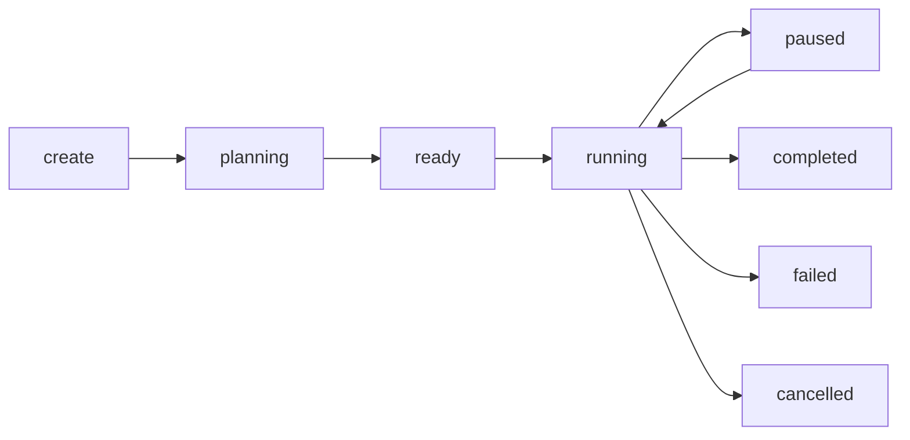

# Mission Control Cockpit — Spécification

> **Le futur tableau de bord d'Hermes OS.** Interface unique pour piloter missions, agents, runtimes, mémoire, compétences et intégrations.

---

## Vues

### 1. Dashboard

Vue d'ensemble avec :
- Santé système (health status)
- Missions actives / terminées / échouées
- Runtimes disponibles et leur santé
- Derniers événements (flux temps réel)
- Agents en cours d'exécution

### 2. Missions

- **Liste** — toutes les missions avec statut, priorité, progression
- **Détail** — graphe d'exécution, agents créés, logs
- **Actions** — create, start, pause, resume, cancel



### 3. Agents

- Liste des agents avec état (CREATED → COMPLETED/FAILED)
- Statistiques : temps d'exécution, nombre de retries
- Callback `on_event()` pour suivi temps réel

### 4. Runtime

- Runtimes enregistrés avec statut, santé, métriques
- Score de décision détaillé (Health/Reliability/Performance/Capability/Policy)
- Circuit breaker status (CLOSED/OPEN/HALF_OPEN)
- Classement performance

### 5. Skills

- Skills enregistrées avec capacités, tags, tokens
- Sélection et recommandation
- Bundles de compétences

### 6. Memory

- Entrées mémoire par scope (SESSION/MISSION/AGENT/PROJECT/USER/GLOBAL/EXPERIENCE)
- Recherche plein texte
- Statistiques d'utilisation

### 7. Events

- Flux temps réel des SystemEvents
- Filtrage par type, source, sévérité
- Export JSON

### 8. Freebuff

- Projets Freebuff liés
- Synchronisation mission ↔ Freebuff

### 9. Infrastructure

- Métriques système (uptime, CPU, mémoire)
- Diagnostics complets

### 10. Logs

- Logs d'audit structurés
- Filtrage par agent, session, type

### 11. Settings

- Configuration du MissionControlService
- Stratégies de planification
- Politiques runtime
- Seuils circuit breaker

---

## WebSocket

```javascript
// Connexion au flux d'événements en temps réel
const ws = new WebSocket("ws://host/ws/events?sources=runtime,memory");

ws.onmessage = (event) => {
    const data = JSON.parse(event.data);
    // data = { id, type, source, timestamp, severity, payload, correlation_id }
};
```

Filtres disponibles :
- `sources` — virgule-séparé : `runtime,memory,mission`
- Aucun filtre = tous les événements

---

## API REST associée

Toutes les routes sous `/api/v1/` :

| Groupe | Routes |
|---|---|
| Missions | `GET/POST /missions`, `GET /missions/{id}`, `POST /missions/{id}/{start,pause,resume,cancel}` |
| Runtimes | `GET /runtimes[/health|/metrics]`, `GET /runtimes/{name}[/{health,metrics}]` |
| Execution | `GET /execution`, `POST /execution/{start,pause,resume,cancel}` |
| Memory | `GET/POST /memory`, `GET/PATCH /memory/{entry_id}`, `GET /memory/{search,statistics}` |
| Skills | `GET /skills`, `POST /skills/{select,recommend}`, `GET /skills/statistics` |
| Events | `GET /events`, `GET /events/{statistics,export}`, `POST /events/{publish,clear}` |
| System | `GET /{health,status,diagnostics,statistics,version}`, `POST /tick` |
