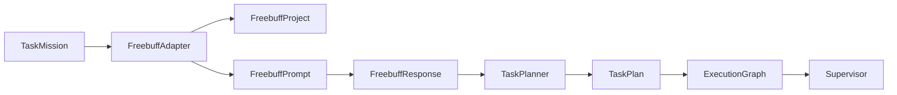

# Intégration Freebuff

> Pont entre Hermes OS et [Freebuff](https://freebuff.com) pour la planification avancée.

## Architecture



## Pipeline

```
Mission Hermes → Transformation → Prompt Freebuff → Réponse Freebuff → TaskPlan → ExecutionGraph → Supervisor
```

## Fonctionnalités

- `create_project()` — création projet Freebuff
- `update_project()` / `archive_project()` — gestion projet
- `generate_prompt()` — transformation mission → prompt
- `submit_prompt()` / `receive_response()` — échange
- `synchronize_project()` — synchronisation mémoire
- `mission_to_plan()` — pipeline complet

## Modes de connexion

- `API` — via HTTP
- `TERMINAL` — via terminal
- `CLI` — via ligne de commande
- `MCP` — via Model Context Protocol (futur)

## Intégrations

| Module HOS | Usage |
|---|---|
| `TaskPlanner` (HOS-018) | `create_plan()` dans `mission_to_plan()` |
| `UnifiedMemory` (HOS-021) | Stockage synchronisations, `link_memory_to_project()` |
| `SystemEventBus` (HOS-025) | Publication événements Freebuff |
