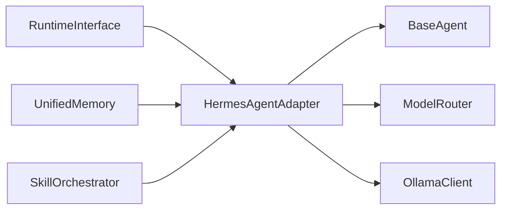

# Intégration Hermes Agent

> Pont entre Hermes OS et [Hermes Agent](https://github.com/NousResearch/hermes-agent) (NousResearch).

## Architecture



## Mapping Hermes OS → Hermes Agent

| Hermes OS | Hermes Agent (via Adapter) |
|---|---|
| `RuntimeInterface` | `as_runtime()` → wrapper Protocol-compatible RAL |
| `RuntimeDecision` | `ModelRouter` (via `BaseAgent.respond()`) |
| `UnifiedMemory` | `sync_memory()` → `EchoAgent.remember()` |
| `AdaptiveSkillOrchestrator` | `list_skills()`, `load_skills()`, `unload_skills()` |
| Task execution | `execute_task()`, `execute_task_stream()` |
| `MultiAgentSupervisor` | `create_subagent()`, `list_subagents()` |

## Capacités exposées

- `CHAT` — conversation
- `CHAT_STREAM` — streaming de tokens
- `TOOLS` — appels d'outils
- `MEMORY` — mémoire persistante
- `SKILLS` — compétences
- `SUBAGENTS` — sous-agents
- `DELEGATION` — délégation de tâches

## Configuration

```python
config = HermesAgentConfiguration(
    base_url="http://localhost:11434",
    keep_alive="10m",
    timeout=120.0,
    auto_reconnect=True,
)
adapter = HermesAgentAdapter(config)
adapter.connect()
```

## Dépendances

- `backend.agents.base_agent` — BaseAgent
- `backend.connectors.ollama_client` — OllamaClientProtocol
- `backend.core.router` — ModelRouter
- `backend.memory.unified_memory` — UnifiedMemory
- `backend.skills.orchestrator` — AdaptiveSkillOrchestrator
